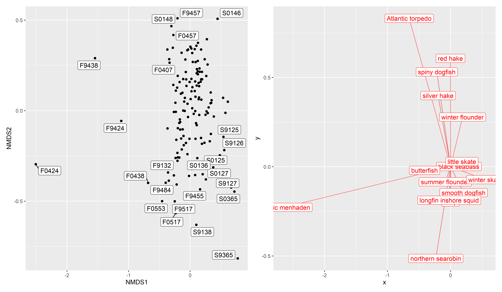
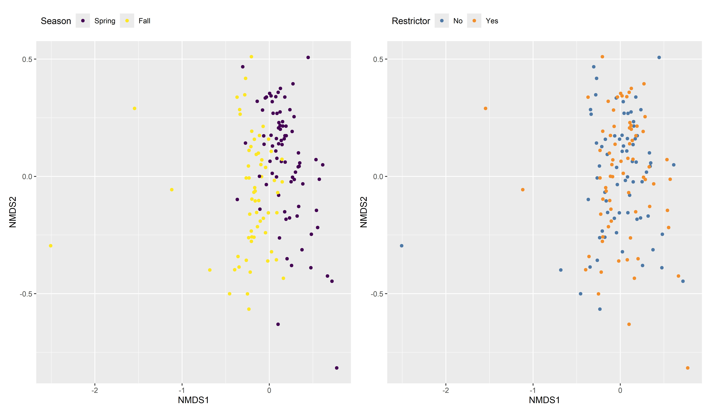
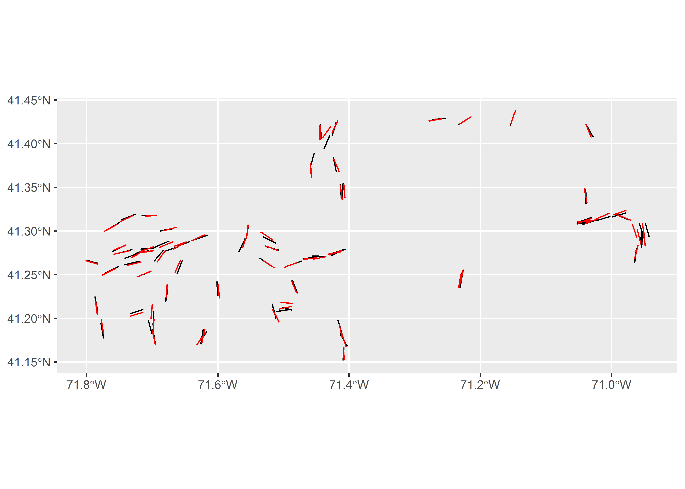
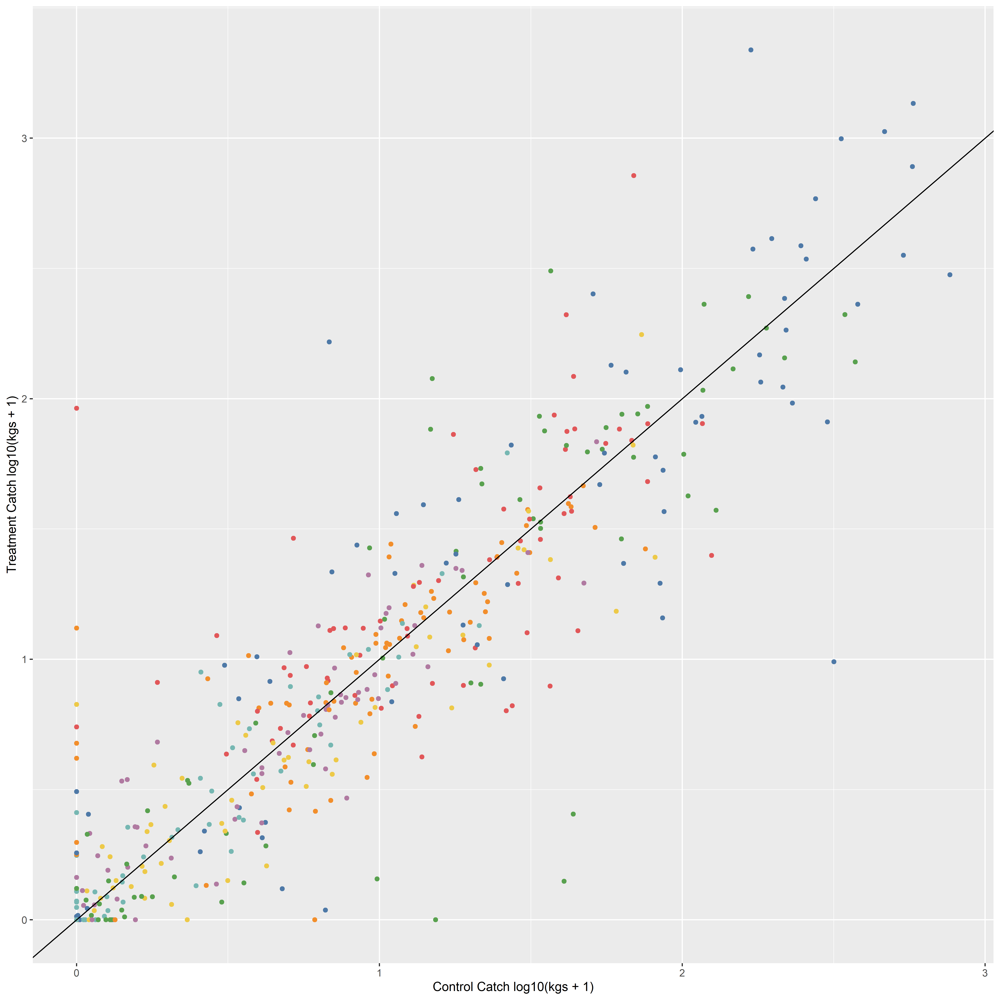
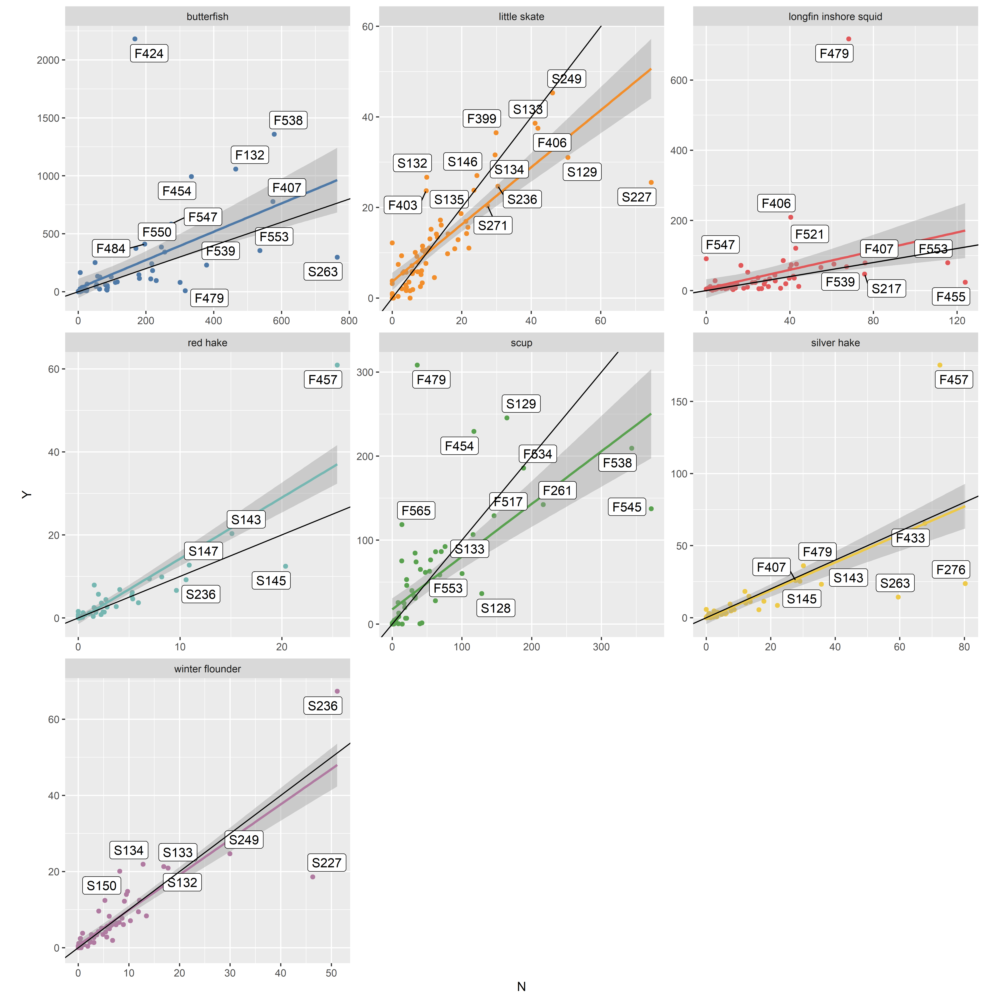
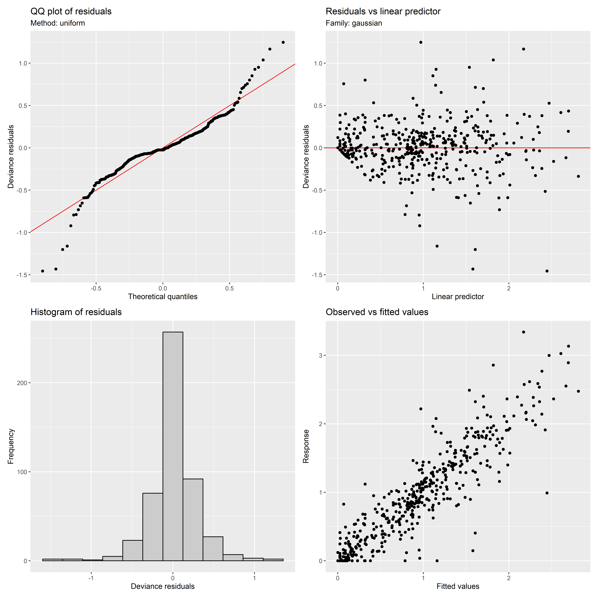
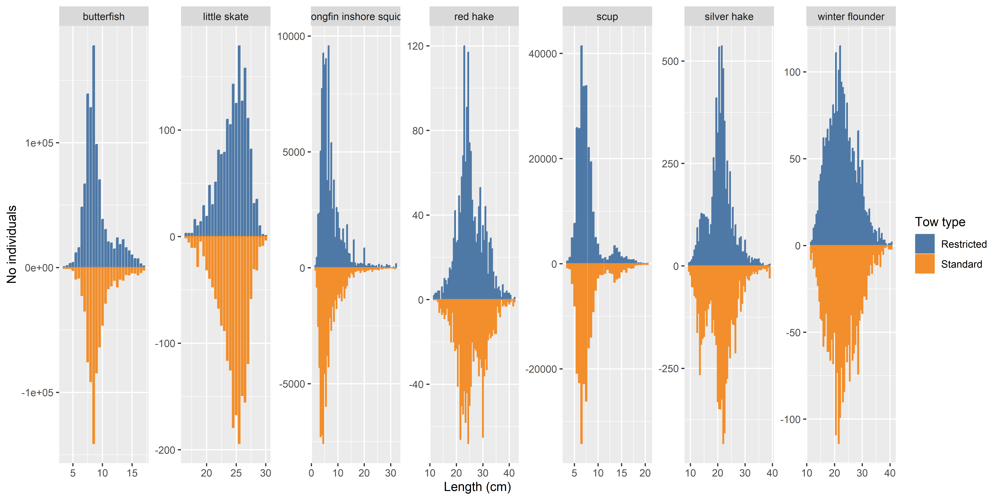
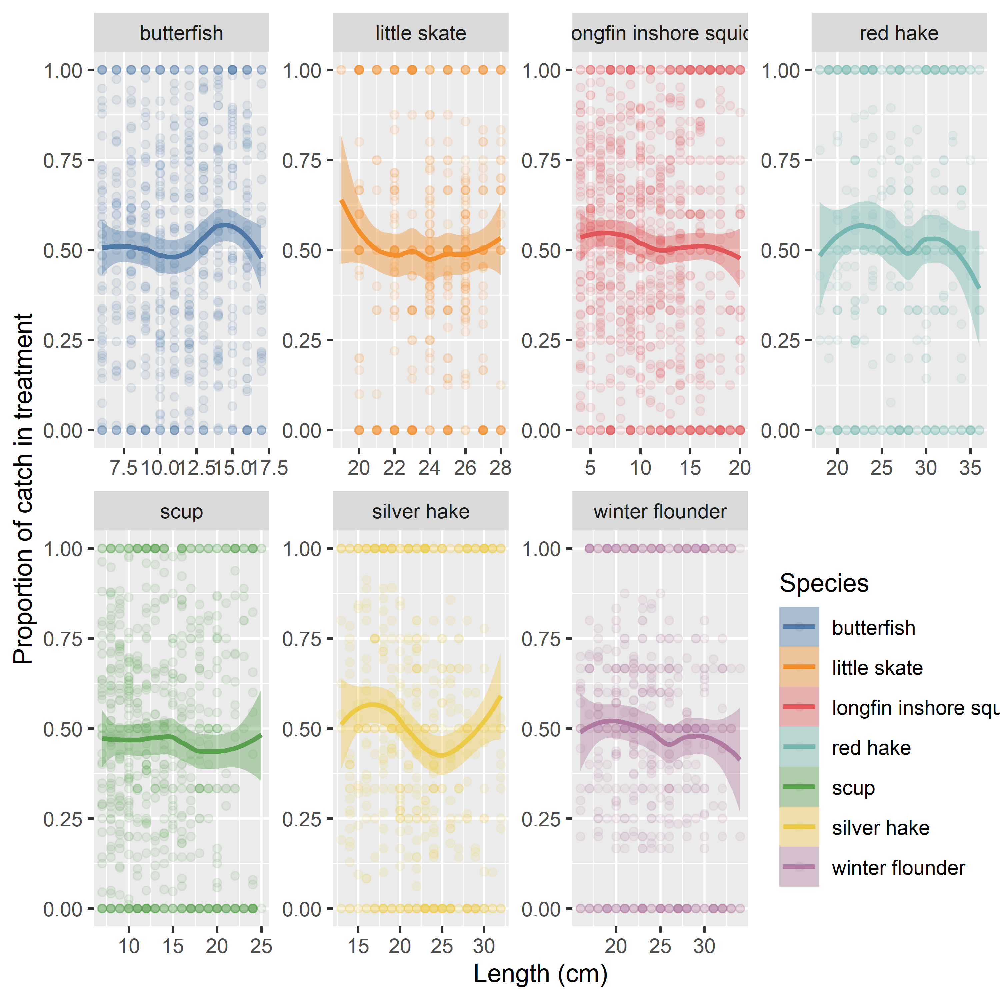
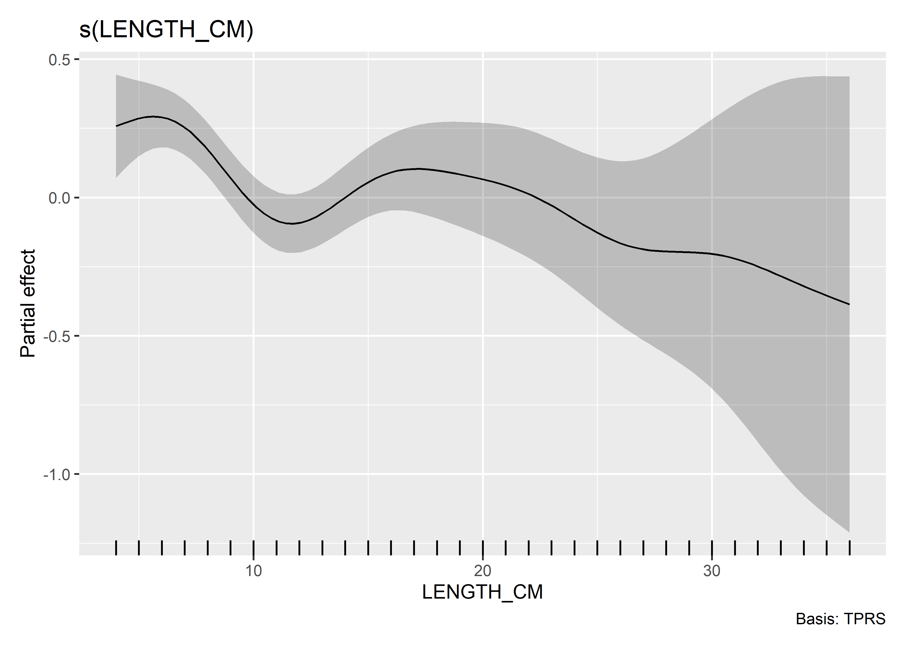

Northeast Trawl Advisory Panel 2022 Restrictor Rope Experiment
================

# Loading data setting options

Here I’m connecting to the MS Access database file.

``` r
knitr::opts_chunk$set(fig.path='figs/',echo=TRUE, warning=FALSE, messages=FALSE, results = TRUE, dpi=500)
# Set specs for knitting to a github_document

## Import RODBC package (and others)
library(RODBC)
library(tidyverse)
library(lubridate)

## Set up driver info and database path
DRIVERINFO <- "Driver={Microsoft Access Driver (*.mdb, *.accdb)};"
#THIS PATH WILL NEED TO BE CHANGED
MDBPATH <- "data/NEAMAP_Restrictor_Exp.mdb"
PATH <- paste0(DRIVERINFO, "DBQ=", MDBPATH)

## Establish connection
channel <- odbcDriverConnect(PATH)

##Look at tables
tbls <- sqlTables(channel)
tbls %>% filter(TABLE_TYPE=='TABLE') %>% dplyr::select(TABLE_NAME)
```

    ##              TABLE_NAME
    ## 1                 Catch
    ## 2              CatchNew
    ## 3             ChloroNew
    ## 4           Chlorophyll
    ## 5              Comments
    ## 6           CommentsNew
    ## 7                  Crew
    ## 8               CrewNew
    ## 9                Cruise
    ## 10            CruiseNew
    ## 11    DogfishpupLensNew
    ## 12       DogfishPupsNew
    ## 13              Habitat
    ## 14           HabitatNew
    ## 15           Individual
    ## 16        IndividualNew
    ## 17              Inverts
    ## 18           LobsterNew
    ## 19           LongfinNew
    ## 20 LW_Check_Individuals
    ## 21 LW_Check_PanAverages
    ## 22                  Pan
    ## 23               PanNew
    ## 24           PotTrapped
    ## 25        PottrappedNew
    ## 26              SpCodes
    ## 27              Station
    ## 28           StationNew
    ## 29              TagsNew
    ## 30            TrackData
    ## 31         TrackDataNew
    ## 32              Weather
    ## 33           WeatherNew
    ## 34                   WQ
    ## 35                WQNew

``` r
## Load data into R dataframe
Catch <- sqlQuery(channel,
"SELECT *
FROM catch;",
stringsAsFactors = FALSE)

## Load data into R dataframe (different function)
StationNew <- sqlFetch(channel, 'StationNew')
Station <- sqlFetch(channel, 'Station')
SpCodes  <- sqlFetch(channel, 'SpCodes')
Comments  <- sqlFetch(channel, 'Comments')
CommentsNew  <- sqlFetch(channel, 'CommentsNew')
Individual <- sqlFetch(channel, 'Individual')
Pan <- sqlFetch(channel, 'Pan')
PanNew <- sqlFetch(channel, 'PanNew')

Weather <- sqlFetch(channel, 'Weather')
WQ <- sqlFetch(channel, 'WQ')

## Close and remove channel
# close(channel)
# rm(channel)

#Pulling in the species table from excel
#THIS PATH WILL NEED TO BE CHANGED
library(readxl)
NM_Species_Code_List_Color_Coordinated <- read_excel("data/NM Species Code List Color Coordinated.xls") %>% mutate(SPCODE=as.character(as.numeric(SPCODE)))
```

# A species subset

This is one way to subset the species. Summarizing the largest counts
and weights and then making a vector of the species on both lists.

``` r
#making a vector of common species
common_spp_wt <- Catch %>% dplyr::group_by(VIMSCODE) %>% dplyr::summarise(TotWght=sum(TotWght)) %>% dplyr::arrange(-TotWght) %>% head(15) %>% .$VIMSCODE
common_spp_ct <- Catch %>% dplyr::group_by(VIMSCODE) %>% dplyr::summarise(COUNT=sum(COUNT)) %>% dplyr::arrange(-COUNT) %>% head(15) %>% .$VIMSCODE

common_spp <- intersect(common_spp_wt,common_spp_ct)
#common_spp

#Looking at common names of these species
NM_Species_Code_List_Color_Coordinated %>% filter(SPCODE %in%  common_spp) %>% print()
```

    ## # A tibble: 10 × 13
    ##    SPCODE COMMON    LATIN PHYLUM CLASS ORDER FAMILY GROUP HABIT PROCESS MERISTIC
    ##    <chr>  <chr>     <chr> <chr>  <chr> <chr> <chr>  <chr> <chr> <chr>   <chr>   
    ##  1 37     Atlantic… Brev… Chord… Acti… Clup… Clupe… bony… <NA>  N       <NA>    
    ##  2 4      butterfi… Pepr… Chord… Acti… Perc… Strom… bony… <NA>  <NA>    <NA>    
    ##  3 71     northern… Prio… Chord… Acti… Scor… Trigl… bony… <NA>  <NA>    <NA>    
    ##  4 15     red hake  Urop… Chord… Acti… Gadi… Gadid… bony… <NA>  N       <NA>    
    ##  5 1      scup      Sten… Chord… Acti… Perc… Spari… bony… <NA>  <NA>    <NA>    
    ##  6 6      silver h… Merl… Chord… Acti… Gadi… Gadid… bony… <NA>  <NA>    <NA>    
    ##  7 44     winter f… Pseu… Chord… Acti… Pleu… Pleur… bony… <NA>  N       <NA>    
    ##  8 171    little s… Leuc… Chord… Elas… Raji… Rajid… cart… <NA>  M       TL      
    ##  9 167    spiny do… Squa… Chord… Elas… Squa… Squal… cart… <NA>  M       TL      
    ## 10 1028   longfin … Loli… Mollu… Ceph… Teut… Lolig… ceph… <NA>  <NA>    <NA>    
    ## # ℹ 2 more variables: `date added` <dttm>, COMMENT <chr>

``` r
Catch %>% dplyr::group_by(VIMSCODE) %>% dplyr::summarise(N_STATIONS=n_distinct(STATION)) %>% dplyr::arrange(-N_STATIONS)
```

    ## # A tibble: 73 × 2
    ##    VIMSCODE N_STATIONS
    ##       <int>      <int>
    ##  1     1028        140
    ##  2        4        135
    ##  3        1        134
    ##  4      171        131
    ##  5        3        120
    ##  6      163        119
    ##  7       44        118
    ##  8        6        110
    ##  9        2         85
    ## 10       15         83
    ## # ℹ 63 more rows

``` r
library(patchwork)
#Making a plot of the numbers weights
a <- Catch %>% dplyr::group_by(VIMSCODE) %>% dplyr::summarise(AvgTotWght=mean(TotWght),TotWght=sum(TotWght)) %>% dplyr::arrange(-TotWght) %>% left_join(.,
          Catch %>% dplyr::group_by(VIMSCODE) %>% dplyr::summarise(AvgTotCOUNT=mean(COUNT),COUNT=sum(COUNT)) %>% dplyr::arrange(-COUNT)) %>%
  left_join(.,Catch %>% dplyr::group_by(VIMSCODE) %>% dplyr::summarise(N_STATIONS=n_distinct(STATION)) %>% dplyr::arrange(-N_STATIONS)) %>%
  left_join(.,NM_Species_Code_List_Color_Coordinated %>% mutate(VIMSCODE=as.numeric(SPCODE)) %>%
              dplyr::select(VIMSCODE,COMMON),by=('VIMSCODE')) %>%
    mutate(PER_STAT = round(1-N_STATIONS/max(N_STATIONS+1),2)) %>% arrange(PER_STAT) %>%
  head(35) %>%
  pivot_longer(names_to = 'metric',values_to = 'value',-COMMON) %>%
  filter(metric != 'VIMSCODE') %>%
  mutate(COMMON = fct_reorder(COMMON, value)) %>%
  ggplot() + geom_bar(aes(x=COMMON,y=value),stat='identity') + facet_wrap(~metric,scales='free') + coord_flip() + scale_y_log10()

b <- Catch %>% dplyr::group_by(VIMSCODE) %>% dplyr::summarise(TotWght=sum(TotWght)) %>% dplyr::arrange(-TotWght) %>% left_join(.,
          Catch %>% dplyr::group_by(VIMSCODE) %>% dplyr::summarise(COUNT=sum(COUNT)) %>% dplyr::arrange(-COUNT)) %>%
  left_join(.,Catch %>% dplyr::group_by(VIMSCODE) %>% dplyr::summarise(N_STATIONS=n_distinct(STATION)) %>% dplyr::arrange(-N_STATIONS)) %>%
  left_join(.,NM_Species_Code_List_Color_Coordinated %>% mutate(VIMSCODE=as.numeric(SPCODE)) %>%
              dplyr::select(VIMSCODE,COMMON),by=('VIMSCODE')) %>%
  pivot_longer(names_to = 'metric',values_to = 'value',-COMMON) %>%
  filter(metric != 'VIMSCODE') %>%
  mutate(COMMON = fct_reorder(COMMON, value)) %>%
  head(35) %>%
  filter(metric == 'COUNT',!COMMON %in% c('butterfish','scup','longfin inshore squid','Atlantic menhaden','silver hake')) %>%
  ggplot() + geom_bar(aes(x=COMMON,y=value),stat='identity') + facet_wrap(~metric,scales='free') + coord_flip()


c <- Catch %>%
  left_join(.,Catch %>% dplyr::group_by(VIMSCODE) %>% dplyr::summarise(N_STATIONS=n_distinct(STATION)) %>% dplyr::arrange(-N_STATIONS)) %>%
  left_join(.,NM_Species_Code_List_Color_Coordinated %>% mutate(VIMSCODE=as.numeric(SPCODE)) %>%
              dplyr::select(VIMSCODE,COMMON),by=('VIMSCODE')) %>%
  #head(35) %>%
  filter(!VIMSCODE %in%  c(1,4,1028)) %>%
  ggplot() + geom_boxplot(data= . %>% filter(COMMON != 'Other'),aes(x=fct_lump(fct_reorder(COMMON,COUNT),15),y=COUNT)) + coord_flip() + scale_y_log10()

d <- Catch %>%
  left_join(.,Catch %>% dplyr::group_by(VIMSCODE) %>% dplyr::summarise(N_STATIONS=n_distinct(STATION)) %>% dplyr::arrange(-N_STATIONS)) %>%
  left_join(.,NM_Species_Code_List_Color_Coordinated %>% mutate(VIMSCODE=as.numeric(SPCODE)) %>%
              dplyr::select(VIMSCODE,COMMON),by=('VIMSCODE')) %>%
  #head(35) %>%
  filter(!VIMSCODE %in%  c(1,4,1028)) %>%
  ggplot() + geom_boxplot(data= . %>% filter(COMMON != 'Other'),aes(x=fct_lump(fct_reorder(COMMON,TotWght),15),y=TotWght)) + coord_flip() + scale_y_log10()
```

# Ordination of stations

We’re using the lat 4 digits of the station code to plot out the catches
in space. The species values are shown in red to highlight the specific
catch elements that are driving patterns. I was thinking about this as
maybe a way to double check for stations or pairs of stations that are
outliers (0424 and 9424 for example). Right now it’s just on the \~20
species we identify above.

``` r
library(vegan)
library(ggvegan)
library(ggrepel)
#Looking at catch data weight
catch_ord <- Catch %>% as.tibble() %>% 
  filter(VIMSCODE %in%  common_spp_wt) %>% #COMMENT OUT TO DO ON FULL SET OF SPECIES
  inner_join(.,Station) %>% mutate(STATION=str_sub(STATION,-4)) %>%
  mutate(SEASON=case_when(month(DATE) < 7 ~ 'S',TRUE~'F')) %>%
  mutate(STATION=paste(SEASON,STATION,sep='')) %>%
  group_by(VIMSCODE,Restrictor,STATION) %>% summarise(TotWght=sqrt(sum(TotWght))) %>% 
  pivot_wider(names_from = c(VIMSCODE),values_from = TotWght,values_fill = 0) %>% as_tibble()

catch_mds <- metaMDS(catch_ord %>% dplyr::select(-Restrictor,-STATION), distance = "bray", autotransform = TRUE,tidy=TRUE)
```

    ## Square root transformation
    ## Wisconsin double standardization
    ## Run 0 stress 0.1627368 
    ## Run 1 stress 0.1634004 
    ## Run 2 stress 0.1642359 
    ## Run 3 stress 0.1647809 
    ## Run 4 stress 0.162788 
    ## ... Procrustes: rmse 0.003857943  max resid 0.03908703 
    ## Run 5 stress 0.1647802 
    ## Run 6 stress 0.1647817 
    ## Run 7 stress 0.164782 
    ## Run 8 stress 0.1627379 
    ## ... Procrustes: rmse 0.0003118201  max resid 0.002863717 
    ## ... Similar to previous best
    ## Run 9 stress 0.1647815 
    ## Run 10 stress 0.1632982 
    ## Run 11 stress 0.1642266 
    ## Run 12 stress 0.1647822 
    ## Run 13 stress 0.1633472 
    ## Run 14 stress 0.1647812 
    ## Run 15 stress 0.1627381 
    ## ... Procrustes: rmse 0.001141237  max resid 0.01163557 
    ## Run 16 stress 0.1627373 
    ## ... Procrustes: rmse 0.0008132958  max resid 0.008274171 
    ## ... Similar to previous best
    ## Run 17 stress 0.1633 
    ## Run 18 stress 0.1647937 
    ## Run 19 stress 0.1627367 
    ## ... New best solution
    ## ... Procrustes: rmse 0.0008771135  max resid 0.00899653 
    ## ... Similar to previous best
    ## Run 20 stress 0.1642358 
    ## *** Best solution repeated 1 times

``` r
# test_set <- fortify(catch_mds) %>% filter(Score == 'sites') %>% cbind(.,catch_ord$STATION) %>% dplyr::rename(STATION=`catch_ord$STATION`) %>%
#   mutate(Restrictor=str_sub(STATION,1,1)) %>%
#   mutate(PAIR=str_sub(STATION,-3)) %>%
#   filter(abs(NMDS1) < 1.5 &  abs(NMDS2) < 1) %>% 
#   count(PAIR) %>%
#   filter(n == 2) %>% .$PAIR

#making some plots
library(patchwork)
library(ggthemes)
a <- fortify(catch_mds) %>% filter(Score == 'sites') %>% 
     cbind(.,catch_ord$STATION) %>% dplyr::rename(STATION=`catch_ord$STATION`) %>%
     mutate(Restrictor=str_sub(STATION,2,2)) %>%
     mutate(PAIR=str_sub(STATION,-3)) %>%
     #filter(PAIR %in% test_set) %>%
     ggplot(aes(x=NMDS1,y=NMDS2)) + geom_point() +
            geom_label_repel(aes(label=STATION)) + 
            theme(legend.position = 'None')

b <- fortify(catch_mds) %>% filter(Score != 'sites') %>% 
     left_join(.,NM_Species_Code_List_Color_Coordinated %>% 
                  #mutate(SPCODE=as.character(as.numeric(SPCODE))) %>% 
                  dplyr::select(VIMSCODE=SPCODE,COMMON), by = c('Label'='VIMSCODE')) %>% 
     ggplot() +
            geom_segment(aes(x=0,xend=NMDS1,y=0,yend=NMDS2),colour='Red',alpha=0.5) +
            geom_label(aes(x=NMDS1,y=NMDS2,label=COMMON),colour='Red')

a + b
```

<!-- -->

``` r
#Season
s <- fortify(catch_mds) %>% filter(Score == 'sites') %>% 
     cbind(.,catch_ord$STATION) %>% dplyr::rename(STATION=`catch_ord$STATION`) %>%
     mutate(Season=str_sub(STATION,1,1)) %>%
     mutate(PAIR=str_sub(STATION,-3)) %>%
     #filter(PAIR %in% test_set) %>%
      mutate(Season = case_when(Season == 'F' ~ 'Fall',TRUE ~ 'Spring')) %>%
      mutate(Season = factor(Season,levels = c("Spring", "Fall"))) %>%
     ggplot(aes(x=NMDS1,y=NMDS2,colour=Season)) + geom_point() +
            #geom_label_repel(aes(label=STATION)) + 
            #theme(legend.position = 'None') + 
            theme(legend.position='top', 
            legend.justification='left',
            legend.direction='horizontal') +
            scale_color_viridis_d()

#Restrictor
r <- fortify(catch_mds) %>% filter(Score == 'sites') %>% 
     cbind(.,catch_ord$STATION) %>% dplyr::rename(STATION=`catch_ord$STATION`) %>%
     mutate(Restrictor=str_sub(STATION,2,2)) %>%
     mutate(PAIR=str_sub(STATION,-3)) %>%
     #filter(PAIR %in% test_set) %>%
     mutate(Restrictor = case_when(Restrictor == '9' ~ 'Yes',TRUE ~ 'No')) %>%
     ggplot(aes(x=NMDS1,y=NMDS2,colour=Restrictor)) + geom_point() +
            #geom_label_repel(aes(label=STATION)) + 
            scale_color_tableau() + 
            theme(legend.position='top', 
            legend.justification='left',
            legend.direction='horizontal')


catch_ordination <- s + r

catch_ordination
```

<!-- -->

# Making a map of the sampling sites

A map of the experimental tow locations.

``` r
#Making a quick map of stations

#Library loading
library(tidyverse)
library(marmap)
```

    ## Registered S3 methods overwritten by 'adehabitatMA':
    ##   method                       from
    ##   print.SpatialPixelsDataFrame sp  
    ##   print.SpatialPixels          sp

    ## 
    ## Attaching package: 'marmap'

    ## The following object is masked from 'package:grDevices':
    ## 
    ##     as.raster

``` r
#for loading the raster library
library(pals)
library(ggthemes)
library(ggnewscale)
library(sf)
```

    ## Linking to GEOS 3.9.3, GDAL 3.5.2, PROJ 8.2.1; sf_use_s2() is TRUE

``` r
library(ggspatial)

#Read in shapefiles
US.areas <- rgdal::readOGR("./shapefiles","USA")
```

    ## OGR data source with driver: ESRI Shapefile 
    ## Source: "C:\Users\andrew.jones\Desktop\PEMAD_CRB_NTAP_RESTRICTOR_ROPE_EXP\shapefiles", layer: "USA"
    ## with 24 features
    ## It has 4 fields

``` r
canada.areas <-rgdal::readOGR("./shapefiles","Canada")
```

    ## OGR data source with driver: ESRI Shapefile 
    ## Source: "C:\Users\andrew.jones\Desktop\PEMAD_CRB_NTAP_RESTRICTOR_ROPE_EXP\shapefiles", layer: "Canada"
    ## with 4998 features
    ## It has 11 fields

``` r
atl <- marmap::getNOAA.bathy(-72,-70, 41, 42,resolution=1)
```

    ## Querying NOAA database ...

    ## This may take seconds to minutes, depending on grid size

    ## Building bathy matrix ...

``` r
#atl <- read.bathy("./bathydata/marmap_coord_-80_33_-66_46_res_1.csv",header = TRUE)
atl = fortify.bathy(atl)

library(inlabru)
```

    ## Loading required package: sp

``` r
#Setting the map boundary
lons = c(min(Station$LONGITUDE_START)-0.1, max(Station$LONGITUDE_START)+0.1)
lats = c(min(Station$LATITUDE_START)-0.1, max(Station$LATITUDE_START)+0.1)


#Making a function to bin the catches
label_interval <- function(breaks) {
  paste0("(", breaks[1:length(breaks) - 1], "-", breaks[2:length(breaks)], ")")
}


  
# Select for start geometries and convert to sf object
pnts_start <- Station %>% st_as_sf( coords = c("LONGITUDE_START", "LATITUDE_START"), crs =  4326)

# Select for end geometries and convert to sf object
pnts_end <- Station %>% st_as_sf(coords = c("LONGITUDE_END", "LATITUDE_END"), crs =  4326)

# Combine start and end geometries
cbind(pnts_start,pnts_end) -> points_ready 

# Generate line segments via union of paired geometries
line_segments <- as.data.frame(st_sfc(mapply(function(a,b){st_cast(st_union(a,b),"LINESTRING")}, points_ready$geometry, points_ready$geometry.1, SIMPLIFY=FALSE)))


line_segments <- cbind(line_segments,Station) %>% mutate(PAIR=str_sub(STATION,-3)) %>%
                            mutate(SEASON=case_when(month(DATE) < 7 ~ 'Spring',TRUE~'Fall')) %>%
                            mutate(PAIR=paste(SEASON,PAIR,sep='')) 

line_segments$SEASON <- factor(line_segments$SEASON,
                levels = c("Spring", "Fall"))

line_segments <- line_segments %>% st_as_sf(crs = 4326)

my_depths <- c(0,10,20,30,40,50,60)
  
sampling_map <- ggplot() + 
  #First bathymetry
  geom_contour_filled(data=atl,
                aes(x=x,y=y,z=-1*z),
                breaks=c(-50,10,20,30,40,50,60),
                size=c(0.1),alpha=0.75) +
  geom_sf() +
  scale_fill_manual(values = brewer.blues(10)[5:10],name=paste("Depth (m)"),labels = label_interval(my_depths)) +
  theme(legend.position = 'bottom', legend.box="vertical", legend.margin=margin()) +
  guides(fill=guide_legend(nrow=2)) +
  theme(legend.key.width=unit(0.25, "cm")) +
  new_scale_fill() +
  #Now the catch data
  #Canada
  geom_sf(data=canada.areas %>% st_as_sf() %>% st_transform(., 4326)) +
  #The US
  geom_sf(data=US.areas %>% st_as_sf() %>% st_transform(., 4326)) +
  geom_sf(data = line_segments, aes(colour=SEASON), size=1) +
  coord_sf(xlim = lons, ylim = lats, crs="+proj=longlat +datum=WGS84") +
  theme_map() +
  #theme(legend.position = 'bottom', legend.box="horizontal", legend.margin=margin()) +
  theme(legend.position = c(1, 0), legend.justification = c(1, 0),
        legend.spacing.y = unit(0.2, "mm"), 
        #panel.border = element_rect(colour = "black", fill=NA),
        aspect.ratio = 1, axis.text = element_text(colour = 1, size = 14),
        legend.background = element_rect(colour = 'White',fill='White'),
        legend.box.background = element_rect(colour = 'White',fill='White')
        ) +
  theme(legend.key.width=unit(0.25, "cm"),legend.text=element_text(size=8)) +
  scale_colour_viridis_d() +
  #scale_color_manual(values = 'Midnight blue') +
  guides(fill=guide_legend(nrow=2),color=guide_legend(nrow=1),size=guide_legend(nrow=2)) +
  annotation_scale(location = "tl", width_hint = 0.3) +
    annotation_north_arrow(location = "tl", which_north = "true", 
        pad_x = unit(0.75, "in"), pad_y = unit(0.5, "in"),
        style = north_arrow_fancy_orienteering) +
  labs(colour='Season')
```

# Adding the solar zenith info

This is coming from an R package astrocalc4r. Interest in light levels
and their impact on catch was of interest from NTAP members.

``` r
library(fishmethods)

zen_data <- Station %>% as_tibble() %>% mutate(hour=hour(TowBegin),day=day(TowBegin),month=month(TowBegin),year=year(TowBegin),timezone = -5)

station_zen_data <- zen_data %>% cbind(.,astrocalc4r(hour=zen_data$hour,day=zen_data$day,month=zen_data$month,
            year=zen_data$year,timezone = zen_data$timezone,
            lat = zen_data$LATITUDE_END,lon = zen_data$LONGITUDE_END,
            withinput = FALSE, seaorland = "maritime", acknowledgment = FALSE))

station_zen_data %>% dplyr::select(month,zenith,hour) %>% ggplot(aes(x=hour,y=zenith,colour=month)) + geom_point()
```

<!-- -->

``` r
pair_zen_data <- station_zen_data %>% 
                    mutate(PAIR=str_sub(STATION,-3)) %>%
                        mutate(SEASON=case_when(month(DATE) < 7 ~ 'S',TRUE~'F')) %>%
                        mutate(PAIR=paste(SEASON,PAIR,sep='')) %>%
                        group_by(PAIR,DATE) %>% summarise(zenith=mean(zenith)) %>%
                        mutate(DATE=as.POSIXct(DATE,format = '%Y-%M-%D')) %>%
                        mutate(SEASON=case_when(month(DATE) < 7 ~ 'Spring',TRUE~'Fall'))
```

    ## `summarise()` has grouped output by 'PAIR'. You can override using the
    ## `.groups` argument.

# Looking at the distance between tows

The goal was to make tows as close together as feasible to make the data
set similar to previous twin trawl based NTAP experiments. The few tows
pairs that were farther apart are identified as well.

``` r
#Looking at the distance between tows
restric_y <- line_segments %>% select(STATION,DATE,geometry,Restrictor) %>% mutate(PAIR=str_sub(STATION,-3)) %>% 
        mutate(SEASON=case_when(month(DATE) < 7 ~ 'S',TRUE~'F')) %>% mutate(PAIR=paste(SEASON,PAIR,sep='')) %>%
        dplyr::select(PAIR,Restrictor,geometry) %>% filter(Restrictor == 'Y') %>% rename(geometry_y = geometry)

restric_n <- line_segments %>% select(STATION,DATE,geometry,Restrictor) %>% mutate(PAIR=str_sub(STATION,-3)) %>% 
        mutate(SEASON=case_when(month(DATE) < 7 ~ 'S',TRUE~'F')) %>% mutate(PAIR=paste(SEASON,PAIR,sep='')) %>%
        dplyr::select(PAIR,Restrictor,geometry) %>% filter(Restrictor != 'Y') %>% rename(geometry_n = geometry)


#ggplot(data=restric_n,aes(x=as.numeric(str_sub(restric_y$PAIR,2,4)),y=as.numeric(str_sub(restric_n$PAIR,2,4)))) + geom_point()

#Looking at the tows
num <- 8

ggplot() +
  geom_sf(data=restric_y$geometry_y) +
  geom_sf(data=restric_n$geometry_n,colour='red')
```

<!-- -->

``` r
#1/4 mile is 400 meters

st_distance(restric_y$geometry_y[num],restric_n$geometry_n[num])
```

    ## Units: [m]
    ##            [,1]
    ## [1,] 205.532723

``` r
#Mean distance
dist <- st_distance(restric_y$geometry_y,restric_n$geometry_n,by_element = FALSE) %>% diag() %>% cbind(.,as.character(str_sub(restric_y$PAIR,1,4))) %>% as.data.frame() 

colnames(dist) <- c("Dist. (m)", "PAIR")

#Min distance (number crossing)
dist <- st_distance(restric_y$geometry_y,restric_n$geometry_n,by_element = FALSE) %>% diag() %>% as.numeric() %>% as_tibble() %>% cbind(.,as.character(str_sub(restric_y$PAIR,1,4))) %>% as.tibble()

colnames(dist) <- c("Dist. (m)", "PAIR")

dist %>% 
  ggplot(aes(x=`Dist. (m)`)) + geom_histogram() + geom_vline(xintercept = 400)
```

    ## `stat_bin()` using `bins = 30`. Pick better value with `binwidth`.

<!-- -->

``` r
#Looking at which PAIR was far apart
dist %>% filter(`Dist. (m)` > 400)
```

    ## # A tibble: 3 × 2
    ##   `Dist. (m)` PAIR 
    ##         <dbl> <chr>
    ## 1       1562. S265 
    ## 2        603. F149 
    ## 3        536. F424

``` r
#Looking at crossing tows
crossing <- dist %>% filter(`Dist. (m)` == 0) %>% .$PAIR
length(crossing)
```

    ## [1] 24

# Adding in the current direction relative to the tow

As reported by the survey crew.

``` r
#Looking current direction in pair

#Codes from Dustin's email
current_codes <- tribble(
~TOW_DIRECTION_CURRENT, ~CURR_DESC,
'1', 'Fair Tide',
'2', 'Head Tide',
'3', 'Perpendicular',
'4', 'Oblique-Fair',
'5', 'Oblique-Head',
'6', 'Slack')

station_pair_current <- Station %>% mutate(PAIR=str_sub(STATION,-3)) %>%
                            mutate(SEASON=case_when(month(DATE) < 7 ~ 'S',TRUE~'F')) %>%
                            mutate(PAIR=paste(SEASON,PAIR,sep='')) %>%
                            dplyr::select(Restrictor,PAIR,TOW_DIRECTION_CURRENT) %>%
                            left_join(.,current_codes) %>%
                            dplyr::select(-TOW_DIRECTION_CURRENT) %>%
                            pivot_wider(names_from = Restrictor,values_from = CURR_DESC) %>%
                            mutate(CURRENT=paste(N,'->',Y)) %>%
                            dplyr::select(PAIR,CURRENT) %>%
                            mutate(CURRENT_DIF = case_when(
                                      CURRENT == 'Head Tide -> Head Tide' ~ 'SAME',
                                      CURRENT == 'Perpendicular -> Perpendicular' ~ 'SAME',
                                      CURRENT == 'Fair Tide -> Fair Tide' ~ 'SAME', 
                                      TRUE ~ 'DIFFERENT'
                            ))
```

    ## Joining with `by = join_by(TOW_DIRECTION_CURRENT)`

``` r
#Looking at how prevalent each of these was
station_pair_current %>% group_by(CURRENT,CURRENT_DIF) %>% tally() %>% arrange(-n)
```

    ## # A tibble: 12 × 3
    ## # Groups:   CURRENT [12]
    ##    CURRENT                        CURRENT_DIF     n
    ##    <chr>                          <chr>       <int>
    ##  1 Head Tide -> Head Tide         SAME           30
    ##  2 Perpendicular -> Perpendicular SAME           16
    ##  3 Fair Tide -> Fair Tide         SAME           13
    ##  4 Head Tide -> Fair Tide         DIFFERENT       3
    ##  5 Slack -> Head Tide             DIFFERENT       2
    ##  6 Fair Tide -> Head Tide         DIFFERENT       1
    ##  7 Fair Tide -> Perpendicular     DIFFERENT       1
    ##  8 Head Tide -> Perpendicular     DIFFERENT       1
    ##  9 NA -> Perpendicular            DIFFERENT       1
    ## 10 Perpendicular -> Head Tide     DIFFERENT       1
    ## 11 Perpendicular -> NA            DIFFERENT       1
    ## 12 Slack -> Fair Tide             DIFFERENT       1

# Assembling Aggregate Weight Data

Putting the catch data together. Comparing weight estimates accounting
for differences in swept area and not accounting for differences in
swept area. Swept area seems to have little impact on weights.

``` r
#Trying out some linear models
catch_rest <- Catch %>% as.tibble() %>%
              complete(
              STATION,VIMSCODE,
              fill = list(TotWght = 0,COUNT=0)
              ) %>%
              inner_join(.,Station) %>% 
              mutate(SA=TowDistTrack*NetWidth,MEAN_SA = mean(SA),
                     Adj_SA = SA/MEAN_SA,TotWght_Adj=TotWght*(Adj_SA)) %>%
              mutate(PAIR=str_sub(STATION,-3)) %>%
              mutate(SEASON=case_when(month(DATE) < 7 ~ 'S',TRUE~'F')) %>%
              mutate(PAIR=paste(SEASON,PAIR,sep='')) %>% 
              group_by(VIMSCODE,Restrictor,PAIR) %>% summarise(TotWght=sum(TotWght)) %>% 
              ungroup() %>%
              pivot_wider(names_from = c(Restrictor,VIMSCODE),
                          values_from = TotWght,values_fill = 0) %>% 
              as_tibble() %>%
              pivot_longer(values_to = c('TotWght'),names_to = 'REST_SPP',-PAIR) %>%
              mutate(Restrictor=str_sub(REST_SPP,1,1),VIMSCODE=str_sub(REST_SPP,3)) %>%
              dplyr::select(-REST_SPP) %>%
              pivot_wider(names_from = Restrictor,values_from = TotWght,values_fill=0) %>%
              mutate(N=log10(N+1),Y=log10(Y+1)) %>%
              left_join(.,NM_Species_Code_List_Color_Coordinated %>% 
                       dplyr::select(VIMSCODE=SPCODE,COMMON), by = c('VIMSCODE'='VIMSCODE')) %>%
              left_join(.,station_pair_current %>% dplyr::select(PAIR,CURRENT_DIF)) %>%
              left_join(.,pair_zen_data %>% dplyr::select(PAIR,zenith)) %>%
              left_join(.,dist)

#Total pairs w/o a couple
catch_rest$PAIR %>% n_distinct()
```

    ## [1] 71

``` r
#Catch with and without swept area
#Checking to see if there is a need to adjust for swept area
Catch %>% as.tibble() %>%
              complete(
              STATION,VIMSCODE,
              fill = list(TotWght = 0,COUNT=0)
              ) %>%
              inner_join(.,Station) %>% 
              mutate(SA=TowDistTrack*NetWidth,MEAN_SA = mean(SA),
                     Adj_SA = SA/MEAN_SA,TotWght_Adj=TotWght*(Adj_SA)) %>% #CONVERTING FOR SWEPT AREA 
              filter(VIMSCODE %in% c(1028,4,1,171,44,6,15)) %>% 
              ggplot(aes(TotWght,TotWght_Adj,color=VIMSCODE)) + geom_point() + facet_wrap(~VIMSCODE,scales='free')
```

<!-- -->

``` r
#Making a plot of catch in control and treatment nets relative to a 1:1 line
#Figure S1
library(ggExtra)
p <- catch_rest %>% filter(VIMSCODE %in% c(1028,4,1,171,44,6,15)) %>%
          ggplot(aes(x=N,y=Y,colour=COMMON)) + geom_point() #+ facet_wrap(~COMMON)

p <- p + geom_abline(slope = 1,intercept = 0) + 
            labs(color='Species',fill='Species',x='Control Catch log10(kgs + 1)',
              y='Treatment Catch log10(kgs + 1)') +
              scale_color_tableau() + scale_fill_tableau() +
              theme(legend.position="bottom") 

p + theme(legend.position="none") -> raw_weight_plot 
#ggMarginal(p, type="density") -> raw_weight_plot

raw_weight_plot
```

<!-- -->

``` r
ind_sp_raw_weight_plot <- p + geom_abline(slope = 1,intercept = 0) + 
    labs(color='Species',fill='Species',x='Control Catch log10(kgs + 1)',
         y='Treatment Catch log10(kgs + 1)') +
    scale_color_tableau() + scale_fill_tableau() +
  theme(legend.position="none") + facet_wrap(~COMMON,scales = 'free')


raw_weight_plot + ind_sp_raw_weight_plot + plot_annotation(tag_levels = 'A')
```

<!-- -->

# A table of catch statisitcs

This table becomes Table 2 and helps us identify the species of interest
for the study.

``` r
#Making a table of catch stats
catch_table <- Catch %>% as.tibble() %>% 
    complete(
    STATION,VIMSCODE,
    fill = list(TotWght = 0,COUNT=0)) %>%
  inner_join(.,Station) %>% 
  mutate(PAIR=str_sub(STATION,-3)) %>%
  mutate(SEASON=case_when(month(DATE) < 7 ~ 'S',TRUE~'F')) %>%
  mutate(PAIR=paste(SEASON,PAIR,sep='')) %>% 
  mutate(POS_STATION=case_when(TotWght > 1 ~ 1, TRUE ~ 0)) %>%
  group_by(VIMSCODE,Restrictor) %>% 
  filter(VIMSCODE %in% c(1028,4,1,171,44,6,15)) %>% 
  dplyr::summarise(AvgTotWght=mean(TotWght),
                   SETotWght=sd(TotWght)/sqrt(142),
                   CVTotWght=sd(TotWght)/AvgTotWght,
                   TotWght=sum(TotWght),
                   AvgTotCOUNT=mean(COUNT),
                   SETotCOUNT=sd(COUNT)/sqrt(142),
                   CVTotCOUNT=sd(COUNT)/AvgTotCOUNT,
                   COUNT=sum(COUNT),
                   N_STATIONS=sum(POS_STATION)) %>%
  dplyr::arrange(-N_STATIONS) %>%
  left_join(.,NM_Species_Code_List_Color_Coordinated %>% mutate(VIMSCODE=as.numeric(SPCODE)) %>%
              dplyr::select(VIMSCODE,COMMON),by=('VIMSCODE')) %>% ungroup() %>%
      mutate(PER_STAT = round(N_STATIONS/max(N_STATIONS+2),2)) %>% 
      arrange(PER_STAT) %>% arrange(desc(N_STATIONS)) %>%
  #filter(AvgTotCOUNT > 10,AvgTotWght>2.5,PER_STAT > 0.35) %>%
  relocate('Restrictor'=Restrictor,'Species'=COMMON,
           'Total positive stations'=N_STATIONS,
           'Proportion positive stations'=PER_STAT,
           'Total weight (kgs)'=TotWght,
           'Station total count'=COUNT,
           'Station mean weight (kgs)'=AvgTotWght,
           'Standard error station weight (kgs)'=SETotWght,
           'Coefficient of variation of station weight (kgs)'=CVTotWght,
           'Station mean count'=AvgTotCOUNT,
           'Standard error of station count'=SETotCOUNT,
           'Coefficient of variation of station count'=CVTotCOUNT)
```

    ## Joining with `by = join_by(STATION)`
    ## `summarise()` has grouped output by 'VIMSCODE'. You can override using the
    ## `.groups` argument.

``` r
catch_table
```

    ## # A tibble: 14 × 13
    ##    Restrictor Species              Total positive stati…¹ Proportion positive …²
    ##    <chr>      <chr>                                 <dbl>                  <dbl>
    ##  1 Y          longfin inshore squ…                     71                   0.97
    ##  2 N          longfin inshore squ…                     68                   0.93
    ##  3 Y          little skate                             64                   0.88
    ##  4 N          little skate                             63                   0.86
    ##  5 N          butterfish                               61                   0.84
    ##  6 Y          butterfish                               60                   0.82
    ##  7 N          scup                                     53                   0.73
    ##  8 Y          scup                                     48                   0.66
    ##  9 Y          winter flounder                          47                   0.64
    ## 10 N          winter flounder                          43                   0.59
    ## 11 Y          silver hake                              38                   0.52
    ## 12 N          silver hake                              37                   0.51
    ## 13 N          red hake                                 28                   0.38
    ## 14 Y          red hake                                 28                   0.38
    ## # ℹ abbreviated names: ¹​`Total positive stations`,
    ## #   ²​`Proportion positive stations`
    ## # ℹ 9 more variables: `Total weight (kgs)` <dbl>, `Station total count` <dbl>,
    ## #   `Station mean weight (kgs)` <dbl>,
    ## #   `Standard error station weight (kgs)` <dbl>,
    ## #   `Coefficient of variation of station weight (kgs)` <dbl>,
    ## #   `Station mean count` <dbl>, `Standard error of station count` <dbl>, …

``` r
library(gt)
ct <- catch_table %>% ungroup() %>% dplyr::select(-VIMSCODE) %>%
  gt(groupname_col = c("Species"),rowname_col = "Restrictor") %>% 
  fmt_number(columns=c(4),decimals = c(2)) %>%
  fmt_number(columns=c(5),decimals = c(0)) %>%
  fmt_number(columns=c(6:12),decimals = c(1)) %>%
  cols_label(Restrictor = md("**Restrictor**"),
    'Total positive stations' = md("**Tot. positive stations**"),
    'Species' = md("**Species**"),
    'Proportion positive stations' = md("**Prop. positive stations**"),
    'Total weight (kgs)' = md("**Total weight (kgs)**"),
    'Station total count' = md("**Station total count**"),
    'Station mean weight (kgs)' = md("**Station mean weight (kgs)**"),
    'Standard error station weight (kgs)' = md("**SE station weight (kgs)**"),
    'Coefficient of variation of station weight (kgs)' = md("**CV of station weight (kgs)**"),
    'Station mean count' = md("**Station mean count**"),
    'Standard error of station count' = md("**SE of station count**"),
    'Coefficient of variation of station count' = md("**CV of station count**")) 

#ct %>% gtsave("tab_2.html") #uncomment to save as html 
```

# More catch composition stats

Also making station summary tables.

``` r
#Looking at the number of number of paired positives
Catch %>% as.tibble() %>% mutate(VIMSCODE=as.character(VIMSCODE)) %>%
                left_join(.,NM_Species_Code_List_Color_Coordinated %>% 
                dplyr::select(VIMSCODE=SPCODE,COMMON), by = c('VIMSCODE'='VIMSCODE')) %>%
              group_by(COMMON,VIMSCODE) %>% tally() %>%
              arrange(-n) %>% mutate(prop_pos=n/142) %>% head(20)
```

    ## # A tibble: 20 × 4
    ## # Groups:   COMMON [20]
    ##    COMMON                VIMSCODE     n prop_pos
    ##    <chr>                 <chr>    <int>    <dbl>
    ##  1 longfin inshore squid 1028       140    0.986
    ##  2 butterfish            4          135    0.951
    ##  3 scup                  1          134    0.944
    ##  4 little skate          171        131    0.923
    ##  5 summer flounder       3          120    0.845
    ##  6 smooth dogfish        163        119    0.838
    ##  7 winter flounder       44         118    0.831
    ##  8 silver hake           6          110    0.775
    ##  9 black seabass         2           85    0.599
    ## 10 fourspot flounder     237         83    0.585
    ## 11 jonah crab            600         83    0.585
    ## 12 red hake              15          83    0.585
    ## 13 winter skate          173         83    0.585
    ## 14 Gulf Stream flounder  247         79    0.556
    ## 15 northern searobin     71          75    0.528
    ## 16 American lobster      20          67    0.472
    ## 17 striped searobin      72          66    0.465
    ## 18 American shad         30          60    0.423
    ## 19 windowpane            63          60    0.423
    ## 20 alewife               26          52    0.366

``` r
station_pair_info <- Station %>% 
                        mutate(PAIR=str_sub(STATION,-3)) %>%
                        mutate(SEASON=case_when(month(DATE) < 7 ~ 'S',TRUE~'F')) %>%
                        mutate(PAIR=paste(SEASON,PAIR,sep='')) %>%
                        dplyr::select(PAIR,DATE,DepthBeg) %>% 
                        mutate(DATE=as.POSIXct(DATE,format = '%Y-%M-%D')) %>%
                        mutate(SEASON=case_when(month(DATE) < 7 ~ 'Spring',TRUE~'Fall')) %>%
                        group_by(PAIR,DATE,SEASON) %>% summarise(DEPTH = mean(DepthBeg,na.rm=TRUE))
```

    ## `summarise()` has grouped output by 'PAIR', 'DATE'. You can override using the
    ## `.groups` argument.

``` r
station_table <- Station %>% 
                        mutate(PAIR=str_sub(STATION,-3)) %>%
                        mutate(SEASON=case_when(month(DATE) < 7 ~ 'S',TRUE~'F')) %>%
                        mutate(PAIR=paste(SEASON,PAIR,sep='')) %>%
                        #dplyr::select(PAIR,DATE,DepthBeg) %>% 
                        mutate(DATE=as.POSIXct(DATE,format = '%Y-%M-%D')) %>%
                        mutate(SEASON=case_when(month(DATE) < 7 ~ 'Spring',TRUE~'Fall')) %>%
                        mutate(PAIR=str_sub(STATION,-4)) %>%
                        mutate(Restrictor=str_sub(PAIR,1,1)) %>%
                        mutate(Restrictor = case_when(Restrictor == '9' ~ 'Yes',TRUE ~ 'No')) %>%
                        group_by(Restrictor,SEASON) %>% 
                        summarise(Stations = n_distinct(STATION),
                                  DEPTH = mean(DepthBeg),
                                  VSPEED = mean(VSPEED),
                                  TowDistTrack= mean(TowDistTrack),
                                  NetHeight = mean(NetHeight),
                                  NetWidth = mean(NetWidth),
                                  CableOut_S = mean(CableOut_S),
                                  DoorWidth= mean(DoorWidth))
```

    ## `summarise()` has grouped output by 'Restrictor'. You can override using the
    ## `.groups` argument.

# Plotting Aggregate Weights By Species

Looking at some of the more common species. Black line is a 1:1. Models
are basic GLM with 95% confidence intervals. Pairs of stations with
outlying values are noted. These outliers are retained for the analysis
but having some impact and potentially could be removed in some cases
(e.g., pair F424 a large school of menhaden was caught in the tow
without a restrictor and the vessel moved away for the paired set with
the restrictor).

``` r
#Could do a lot more like this
library(ggrepel)

Catch %>% as.tibble() %>% 
  inner_join(.,Station) %>% 
  mutate(PAIR=str_sub(STATION,-3)) %>%
  mutate(SEASON=case_when(month(DATE) < 7 ~ 'S',TRUE~'F')) %>%
  mutate(PAIR=paste(SEASON,PAIR,sep='')) %>% 
  #filter(!PAIR %in% c(479,227,457)) %>%
  group_by(VIMSCODE,Restrictor,PAIR) %>% summarise(TotWght=sum(TotWght)) %>% 
  pivot_wider(names_from = c(Restrictor,VIMSCODE),values_from = TotWght,values_fill = 0) %>%
  as_tibble() %>%
  pivot_longer(values_to = c('TotWght'),names_to = 'REST_SPP',-PAIR) %>%
  mutate(Restrictor=str_sub(REST_SPP,1,1),VIMSCODE=str_sub(REST_SPP,3)) %>%
  dplyr::select(-REST_SPP) %>%
  pivot_wider(names_from = Restrictor,values_from = TotWght,values_fill=0) %>% #filter(N>0,Y>0) %>%
  left_join(.,NM_Species_Code_List_Color_Coordinated %>% 
           dplyr::select(VIMSCODE=SPCODE,COMMON), by = c('VIMSCODE'='VIMSCODE')) %>%
  filter(VIMSCODE %in% c(1028,4,1,171,44,6,15)) %>% 
  left_join(.,station_pair_info) %>% as_tibble() %>% 
  #mutate(N=pracma::nthroot(N,4),Y=pracma::nthroot(Y,4)) %>%
  #mutate(N=log10(N+1),Y=log10(Y+1)) %>%
  left_join(.,station_pair_current %>% dplyr::select(PAIR,CURRENT_DIF)) %>%
  left_join(.,pair_zen_data %>% dplyr::select(PAIR,zenith)) %>%
  ggplot(aes(x=N,y=Y)) + geom_point(aes(colour=COMMON)) + theme(legend.position = 'None') +
  stat_smooth(method = 'glm',level = 0.95,aes(colour=COMMON)) + geom_label_repel(aes(label=PAIR)) +
  geom_abline(slope = 1,intercept = 0) + facet_wrap(.~COMMON,scales='free') +
  theme(aspect.ratio = 1) + scale_color_tableau()
```

    ## Joining with `by = join_by(STATION)`
    ## `summarise()` has grouped output by 'VIMSCODE', 'Restrictor'. You can override
    ## using the `.groups` argument.
    ## Joining with `by = join_by(PAIR)`
    ## Joining with `by = join_by(PAIR)`
    ## Joining with `by = join_by(PAIR)`
    ## `geom_smooth()` using formula = 'y ~ x'

<!-- -->

# Aggregate weight model analysis

This is just one way to explore how well the values from paired stations
align. We’re log 10 + constant (1) transforming the data then fitting a
simple model to the data. Values on the x axis are catches without the
restrictor and values on the y are catches with the restrictor. The
plots aren’t exactly what the model is showing, but they are similar.

``` r
library(performance)
library(lme4)
library(jtools)
library(sjPlot)

#Making data for fitting an aggregate model
mod_data <- catch_rest %>% 
            filter(VIMSCODE %in% c(1028,4,1,171,44,6,15)) %>% 
            left_join(.,station_pair_info) %>%
            dplyr::select(-DATE) %>% 
            mutate(COMMON=as.factor(COMMON),CURRENT_DIF=as.factor(CURRENT_DIF))

#mod_data$COMMON <- fct_rev(mod_data$COMMON)
#mod_data$CURRENT_DIF <- fct_rev(mod_data$CURRENT_DIF)

library(mgcv)
library(gratia)
model_0 <- gam(Y ~ s(N), 
               data = mod_data, method='REML')

model_1 <- gam(Y ~ s(N)+ s(N,COMMON,bs='sz'), 
               data = mod_data, method='REML')

model_2 <- gam(Y ~ s(N)+ s(N, by = COMMON), 
               data = mod_data, method='REML')

compare_performance(model_0,model_1,model_2,rank=TRUE,metrics = c('R2','RMSE','AIC weights'))
```

    ## # Comparison of Model Performance Indices
    ## 
    ## Name    | Model |    R2 |  RMSE | Performance-Score
    ## ---------------------------------------------------
    ## model_1 |   gam | 0.838 | 0.286 |           100.00%
    ## model_2 |   gam | 0.837 | 0.289 |            89.92%
    ## model_0 |   gam | 0.819 | 0.308 |             0.00%

``` r
AIC(model_1)
```

    ## [1] 214.183413

``` r
(model_1)
```

    ## 
    ## Family: gaussian 
    ## Link function: identity 
    ## 
    ## Formula:
    ## Y ~ s(N) + s(N, COMMON, bs = "sz")
    ## 
    ## Estimated degrees of freedom:
    ##  3.15 16.53  total = 20.68 
    ## 
    ## REML score: 128.602197

``` r
appraise(model_1)
```

<!-- -->

``` r
summary(model_1)
```

    ## 
    ## Family: gaussian 
    ## Link function: identity 
    ## 
    ## Formula:
    ## Y ~ s(N) + s(N, COMMON, bs = "sz")
    ## 
    ## Parametric coefficients:
    ##              Estimate Std. Error t value   Pr(>|t|)    
    ## (Intercept) 0.9192223  0.0203138 45.2512 < 2.22e-16 ***
    ## ---
    ## Signif. codes:  0 '***' 0.001 '**' 0.01 '*' 0.05 '.' 0.1 ' ' 1
    ## 
    ## Approximate significance of smooth terms:
    ##                  edf  Ref.df         F    p-value    
    ## s(N)         3.14563  3.9099 177.01051 < 2.22e-16 ***
    ## s(N,COMMON) 16.53388 18.5175   3.57254 1.5241e-06 ***
    ## ---
    ## Signif. codes:  0 '***' 0.001 '**' 0.01 '*' 0.05 '.' 0.1 ' ' 1
    ## 
    ## R-sq.(adj) =  0.838   Deviance explained = 84.4%
    ## -REML =  128.6  Scale est. = 0.085202  n = 497

``` r
#Each species relationship
new_data_1 <-mod_data %>% filter(COMMON == unique(mod_data$COMMON)[1])
new_data_2 <-mod_data %>% filter(COMMON == unique(mod_data$COMMON)[2])
new_data_3 <-mod_data %>% filter(COMMON == unique(mod_data$COMMON)[3])
new_data_4 <-mod_data %>% filter(COMMON == unique(mod_data$COMMON)[4])
new_data_5 <-mod_data %>% filter(COMMON == unique(mod_data$COMMON)[5])
new_data_6 <-mod_data %>% filter(COMMON == unique(mod_data$COMMON)[6])
new_data_7 <-mod_data %>% filter(COMMON == unique(mod_data$COMMON)[7])

new_data <- bind_rows(new_data_1,new_data_2,new_data_3,new_data_4,new_data_5,new_data_6,new_data_7)
m1_pred <- fitted_values(model_2, data = new_data, scale = "response")

p <- ggplot(m1_pred, aes(x = 10^N, y = 10^fitted,
                    colour = COMMON,group=COMMON)) +
    geom_rug(aes(x=10^N,colour=COMMON),sides='b') +
    #geom_point(data=aes())
    geom_line() +
    #geom_point()
    geom_ribbon(aes(x=10^N,ymax=10^upper,ymin=10^lower,fill=COMMON,group=COMMON),alpha=0.2) +
    facet_wrap(~ COMMON,scales='free',ncol=4) +
    geom_abline(slope = 1,intercept = 0) + 
    labs(color='Species',fill='Species',x='Control Catch (kgs)',
         y='Treatment Catch (kgs)') +
    scale_color_tableau() + scale_fill_tableau() +
    scale_x_log10() + scale_y_log10()


library(lemon)
shift_legend2 <- function(p) {
  # ...
  # to grob
  gp <- ggplotGrob(p)
  facet.panels <- grep("^panel", gp[["layout"]][["name"]])
  empty.facet.panels <- sapply(facet.panels, function(i) "zeroGrob" %in% class(gp[["grobs"]][[i]]))
  empty.facet.panels <- facet.panels[empty.facet.panels]

  # establish name of empty panels
  empty.facet.panels <- gp[["layout"]][empty.facet.panels, ]
  names <- empty.facet.panels$name
  # example of names:
  #[1] "panel-3-2" "panel-3-3"

# now we just need a simple call to reposition the legend
  reposition_legend(p, 'center', panel=names)
}

h <- shift_legend2(p)
```

<!-- -->

``` r
#All species combined
new_data_all <- tidyr::expand(mod_data,
                          N = unique(N))

m1_pred_all <- fitted_values(model_1, data = new_data, scale = "response",exclude='s(N,COMMON)')

g <- ggplot(m1_pred_all, aes(x = 10^N, y = 10^fitted)) +
    geom_rug(aes(x=10^N),sides='b') +
    #geom_point(data=aes())
    geom_line() +
    #geom_point()
    geom_ribbon(aes(x=10^N,ymax=10^upper,ymin=10^lower),alpha=0.2) +
    geom_abline(slope = 1,intercept = 0) +
    labs(x='Control Catch (kgs)',
         y='Treatment Catch (kgs)') +
    scale_color_tableau() + scale_fill_tableau() +
    scale_x_log10() + scale_y_log10()

aggregate_weight <- (g + h)


# Making a table of some of the weight model stats
model_fam <- c(model_0 %>% summary() %>% .$family %>% .[1],
                          model_1 %>% summary() %>% .$family %>% .[1],
                          model_2 %>% summary() %>% .$family %>% .[1])

model_link <- c(model_0 %>% summary() %>% .$family %>% .[2],
                          model_1 %>% summary() %>% .$family %>% .[2],
                          model_2 %>% summary() %>% .$family %>% .[2])

model_formula <- c(model_0 %>% summary() %>% .$formula,
                          model_1 %>% summary() %>% .$formula,
                          model_2 %>% summary() %>% .$formula)

model_tab <- tibble(

'Model' = c('Model 0','Model 1','Model 2'), 

'Family' = model_fam,
'Link' = model_link,
'Formula' = model_formula,

'n' = c(summary(model_0)$n,summary(model_1)$n,summary(model_2)$n),
'Degrees of freedom' = c(AIC(model_0,model_1,model_2)$df),
'Resid. degrees of freedom' = c(summary(model_0)$residual.df,summary(model_1)$residual.df,summary(model_2)$residual.df),
'R^2' = c(summary(model_0)$r.sq,summary(model_1)$r.sq,summary(model_2)$r.sq),
'Deviance explained' = c(summary(model_0)$dev.expl,summary(model_1)$dev.expl,summary(model_2)$dev.expl),
'AIC' = c(AIC(model_0,model_1,model_2)$AIC)) %>% arrange(`AIC`)
```

# Exploring the individual data

Looking at density plots for each of the focus species. The expansion of
counts happens using the ‘uncount’ function in dplyr.

``` r
#Making long data for plotting with ggplot
individual_data <- Individual %>% 
  left_join(.,Station) %>% 
  filter(VIMSCODE %in% c(1028,4,1,171,44,6,15)) %>% 
  #uncount(round(ExpFactMeas_SA,0)) %>%
  uncount(round(ExpFactMeas,0)) %>%
  mutate(SEASON=case_when(month(DATE) < 7 ~ 'Spring',TRUE~'Fall')) %>%
  #dplyr::group_by(STATION,Restrictor,VIMSCODE,LENGTH,SEASON) %>%
  #dplyr::summarise(count=sum(LENGTH)) %>%
  left_join(.,NM_Species_Code_List_Color_Coordinated %>% mutate(VIMSCODE=as.numeric(SPCODE)) %>%
           dplyr::select(VIMSCODE,COMMON), by = c('VIMSCODE'='VIMSCODE')) %>%
  ungroup() %>%
  #removing some outliers
  mutate(LENGTH_CM = round(LENGTH/10,0)) %>%
  group_by(COMMON) %>%
  mutate(LENGTH_NTILE = ntile(LENGTH_CM,n=500)) %>%
  filter(LENGTH_NTILE > 1,LENGTH_NTILE < 499) %>%
  ungroup() 

#Making a plot with mirrored lengths
ml <- ggplot(individual_data %>% mutate(Restrictor = case_when(Restrictor == 'Y' ~ 'Restricted',TRUE ~ 'Standard')), aes(x=LENGTH/10,fill=Restrictor,color=Restrictor,group=Restrictor) ) +
  geom_histogram(data = . %>% filter(Restrictor=='Restricted'), aes(y = after_stat(count),fill=Restrictor),binwidth = .25) +
  geom_histogram(data = . %>% filter(Restrictor!='Restricted'), aes(y = - after_stat(count),fill=Restrictor),binwidth = .25) +
  facet_wrap(~COMMON,scales = 'free',ncol=7) + scale_fill_tableau() + scale_color_tableau() +
  labs(color='Tow type',fill="Tow type",x='Length (cm)',y='No individuals')

ml -> mirrored_lengths

mirrored_lengths
```

<!-- -->

# Length based modeling

## Making data and testing for over/under dispersion

Fitting a regular GLM to the individual data to determine if a binomial
model is appropriate (i.e., ‘Dispersion parameter for binomial family
taken to be 1’).

``` r
#Making wide format data for fitting binomial model
length_mod_data <- Individual %>% filter(VIMSCODE %in% c(1028,4,1,171,44,6,15)) %>%
                      #::skim()
                      left_join(.,Station) %>% 
                      #nrow()
                      uncount(round(ExpFactMeas,0)) %>%
                      mutate(PAIR=str_sub(STATION,-3)) %>%
                      mutate(SEASON=case_when(month(DATE) < 7 ~ 'S',TRUE~'F')) %>%
                      mutate(PAIR=paste(SEASON,PAIR,sep='')) %>%
                      dplyr::group_by(STATION,PAIR,Restrictor,VIMSCODE,LENGTH,SEASON) %>%
                      tally() %>% mutate(count = n) %>% dplyr::select(-n) %>%
                      pivot_wider(values_from = count,names_from = Restrictor,-STATION,values_fill=0) %>%
                      left_join(.,NM_Species_Code_List_Color_Coordinated %>% mutate(VIMSCODE=as.numeric(SPCODE)) %>%
                      dplyr::select(VIMSCODE,COMMON), by = c('VIMSCODE'='VIMSCODE')) %>%
                      left_join(.,station_pair_current %>% dplyr::select(PAIR,CURRENT_DIF)) %>%
                      left_join(.,pair_zen_data %>% dplyr::select(PAIR,zenith)) %>%
                      mutate(LENGTH_CM = round(LENGTH/10,0)) %>%
                      group_by(PAIR,VIMSCODE,LENGTH_CM,SEASON,COMMON,CURRENT_DIF,zenith) %>% 
                      summarise(N=sum(N),Y=sum(Y),TOT = sum(N,Y),PROP=Y/TOT) %>%
                      group_by(COMMON) %>%
                      mutate(LENGTH_NTILE = ntile(LENGTH_CM,100)) %>%
                      filter(LENGTH_NTILE > 10,LENGTH_NTILE < 90)

# Plot with a loess smooth
t <- length_mod_data %>% ggplot(aes(x=LENGTH_CM,y=PROP,colour=COMMON,fill=COMMON)) + geom_point(alpha=0.1) + stat_smooth(method="loess") + facet_wrap(~COMMON,ncol=4,scales='free') + scale_color_tableau() + scale_fill_tableau() + labs(x='Length (cm)',y='Proportion of catch in treatment',colour='Species',fill='Species')

catch_at_length_exploration <- shift_legend2(t)
```

<!-- -->

``` r
#Adding averaged station covariates
station_pair_info_avg <- Station %>% mutate(PAIR=str_sub(STATION,-3)) %>%
                            mutate(SEASON=case_when(month(DATE) < 7 ~ 'S',TRUE~'F')) %>%
                            mutate(PAIR=paste(SEASON,PAIR,sep='')) %>%
                            group_by(PAIR) %>%
                            dplyr::summarise(DoorWidth=mean(DoorWidth),SCOPE=mean(SCOPE),CableOut_P=mean(CableOut_P),
                                             LATITUDE_END=mean(LATITUDE_END),
                                             LONGITUDE_END=mean(LONGITUDE_END),
                                             LATITUDE_START=mean(LATITUDE_START),
                                             LONGITUDE_START=mean(LONGITUDE_START),
                                             NetWidth=mean(NetWidth),
                                             NetHeight=mean(NetHeight),TOWDIST=mean(TOWDIST),
                                             VSPEED=mean(VSPEED),DepthEnd=mean(DepthEnd),DepthBeg=mean(DepthBeg))

#Looking at which tow was first
station_pair_info_order <- Station %>% mutate(PAIR=str_sub(STATION,-3)) %>%
                            mutate(SEASON=case_when(month(DATE) < 7 ~ 'S',TRUE~'F')) %>%
                            mutate(PAIR=paste(SEASON,PAIR,sep='')) %>%
                            dplyr::select(Restrictor,PAIR,TowBegin) %>%
                            mutate(TowBegin=as.POSIXct(TowBegin,format='%Y-%M-%D %H:%M:%S')) %>%
                            pivot_wider(names_from = Restrictor,values_from = TowBegin) %>%
                            mutate(ORDER=case_when(Y > N ~ 'YN',TRUE ~ 'NY')) %>%
                            dplyr::select(PAIR,ORDER)

#Adding station information
length_mod_data <- length_mod_data %>% left_join(.,station_pair_info_order) %>% left_join(.,station_pair_info_avg)

#Loading mgcv for fitting
library(mgcv)

#Looking at the dispersion in the data
library(dispmod)
length_mod_bi_0 <- glm(cbind(Y,N) ~ LENGTH_CM,
                      data=length_mod_data %>% mutate(PAIR=as.factor(PAIR)) %>% ungroup(),
                      family=binomial(link="logit"))

model.disp.test <- glm.binomial.disp(length_mod_bi_0, verbose = T)
```

    ## 
    ## Binomial overdispersed logit model fitting...
    ## Iter.  1  phi: 0.242005081 
    ## Iter.  2  phi: 0.278520996 
    ## Iter.  3  phi: 0.278057238 
    ## Iter.  4  phi: 0.278062678 
    ## Iter.  5  phi: 0.278062614 
    ## Converged after 5 iterations. 
    ## Estimated dispersion parameter: 0.278062615 
    ## 
    ## Call:
    ## glm(formula = cbind(Y, N) ~ LENGTH_CM, family = binomial(link = "logit"), 
    ##     data = length_mod_data %>% mutate(PAIR = as.factor(PAIR)) %>% 
    ##         ungroup(), weights = disp.weights)
    ## 
    ## Deviance Residuals: 
    ##        Min          1Q      Median          3Q         Max  
    ## -2.2902676  -1.0097642   0.0141171   0.9761985   2.2306840  
    ## 
    ## Coefficients:
    ##                Estimate  Std. Error  z value Pr(>|z|)  
    ## (Intercept)  0.11118334  0.04553330  2.44180 0.014614 *
    ## LENGTH_CM   -0.00564475  0.00254826 -2.21514 0.026750 *
    ## ---
    ## Signif. codes:  0 '***' 0.001 '**' 0.01 '*' 0.05 '.' 0.1 ' ' 1
    ## 
    ## (Dispersion parameter for binomial family taken to be 1)
    ## 
    ##     Null deviance: 5681.565  on 4431  degrees of freedom
    ## Residual deviance: 5676.656  on 4430  degrees of freedom
    ## AIC: 7144.564
    ## 
    ## Number of Fisher Scoring iterations: 3

``` r
print(paste("Dispersion parameter is:", model.disp.test$dispersion))
```

    ## [1] "Dispersion parameter is: 0.278062614567398"

## Fitting length-based GAMM models

Here we’re interested in if there are significant effects of the
covariates and how large the effects are.

``` r
#Fitting basic binomial GAM models then adding in random intercepts for the station pair and a random slope for each station pair
library(mgcv)
library(gratia)

length_mod_bi_0 <- gam(PROP ~ s(LENGTH_CM) + s(LENGTH_CM,COMMON,bs='sz') + 
                         s(PAIR,bs='re'),
                      weights = TOT,
                      data=length_mod_data %>%
                      mutate(PAIR=as.factor(as.character(PAIR)),COMMON=as.factor(COMMON)),
                      family=binomial(link="logit"),method='REML',select=TRUE)

length_mod_bi_1 <- gam(PROP ~ s(LENGTH_CM) + s(LENGTH_CM,COMMON,bs='sz') + 
                         s(PAIR,bs='re') + s(DepthEnd) + s(zenith) + 
                         (ORDER) + (SEASON) + (CURRENT_DIF),
                      weights = TOT,
                      data=length_mod_data %>%
                      mutate(PAIR=as.factor(as.character(PAIR)),COMMON=as.factor(COMMON)),
                      family=binomial(link="logit"),method='REML',select=TRUE)

length_mod_bi_2 <- gam(PROP ~ s(LENGTH_CM) + s(LENGTH_CM,COMMON,bs='sz') + 
                         s(PAIR,bs='re'),
                      weights = TOT,
                      data=length_mod_data %>%
                      mutate(PAIR=as.factor(as.character(PAIR)),COMMON=as.factor(COMMON)),
                      family=quasibinomial(link="logit"),method='REML',select=TRUE)

length_mod_bi_3 <- gam(PROP ~ s(LENGTH_CM) + s(LENGTH_CM,COMMON,bs='sz') + 
                         s(PAIR,bs='re') + s(DepthEnd) + s(zenith) + 
                         (ORDER) + (SEASON) + (CURRENT_DIF),
                      weights = TOT,
                      data=length_mod_data %>%
                      mutate(PAIR=as.factor(as.character(PAIR)),COMMON=as.factor(COMMON)),
                      family=quasibinomial(link="logit"),method='REML',select=TRUE)
```

# Comparing model fits

Making plots of model predictions for the best model fit to individual
catch data.

``` r
#Comparing model fit
compare_performance(length_mod_bi_0,length_mod_bi_1,length_mod_bi_2,length_mod_bi_3,metrics ='common',rank=TRUE)
```

    ## # Comparison of Model Performance Indices
    ## 
    ## Name            | Model |    R2 |  RMSE | Performance-Score
    ## -----------------------------------------------------------
    ## length_mod_bi_2 |   gam | 0.539 | 0.347 |           100.00%
    ## length_mod_bi_3 |   gam | 0.539 | 0.347 |            73.90%
    ## length_mod_bi_1 |   gam | 0.539 | 0.350 |            23.30%
    ## length_mod_bi_0 |   gam | 0.539 | 0.350 |             0.00%

``` r
#Making a table of mode lfit statistics
length_model_fam <- c(length_mod_bi_0 %>% summary() %>% .$family %>% .[1],
                          length_mod_bi_1 %>% summary() %>% .$family %>% .[1],
                          length_mod_bi_2 %>% summary() %>% .$family %>% .[1],
                          length_mod_bi_3 %>% summary() %>% .$family %>% .[1]
                      )

length_model_link <- c(length_mod_bi_0 %>% summary() %>% .$family %>% .[2],
                          length_mod_bi_1 %>% summary() %>% .$family %>% .[2],
                          length_mod_bi_2 %>% summary() %>% .$family %>% .[2],
                          length_mod_bi_3 %>% summary() %>% .$family %>% .[2]
                       )

length_model_formula <- c(length_mod_bi_0 %>% summary() %>% .$formula,
                          length_mod_bi_1 %>% summary() %>% .$formula,
                          length_mod_bi_2 %>% summary() %>% .$formula,
                          length_mod_bi_3 %>% summary() %>% .$formula
                       )

length_model_tab <- tibble(

'Model' = c('Model 0','Model 1','Model 2','Model 3'), 

'Family' = length_model_fam,
'Link' = length_model_link,
'Formula' = length_model_formula,

'n' = c(summary(length_mod_bi_0)$n,summary(length_mod_bi_1)$n,summary(length_mod_bi_2)$n,summary(length_mod_bi_3)$n),
'Degrees of freedom' = c(AIC(length_mod_bi_0,length_mod_bi_1,length_mod_bi_2,length_mod_bi_3)$df),
'Resid. degrees of freedom' = c(summary(length_mod_bi_0)$residual.df,summary(length_mod_bi_1)$residual.df,summary(length_mod_bi_2)$residual.df,summary(length_mod_bi_3)$residual.df),
'R^2' = c(summary(length_mod_bi_0)$r.sq,summary(length_mod_bi_1)$r.sq,summary(length_mod_bi_2)$r.sq,summary(length_mod_bi_3)$r.sq),
'Deviance explained' = c(summary(length_mod_bi_0)$dev.expl,summary(length_mod_bi_1)$dev.expl,summary(length_mod_bi_2)$dev.expl,summary(length_mod_bi_3)$dev.expl),
'AIC' = c(AIC(length_mod_bi_0,length_mod_bi_1,length_mod_bi_2,length_mod_bi_3)$AIC)) %>% arrange(`Degrees of freedom`)


#Looking at the best model
summary(length_mod_bi_2) 
```

    ## 
    ## Family: quasibinomial 
    ## Link function: logit 
    ## 
    ## Formula:
    ## PROP ~ s(LENGTH_CM) + s(LENGTH_CM, COMMON, bs = "sz") + s(PAIR, 
    ##     bs = "re")
    ## 
    ## Parametric coefficients:
    ##              Estimate Std. Error t value Pr(>|t|)
    ## (Intercept) 0.0878819  0.1021954 0.85994  0.38987
    ## 
    ## Approximate significance of smooth terms:
    ##                          edf Ref.df        F    p-value    
    ## s(LENGTH_CM)         4.72403      9  11.7944 < 2.22e-16 ***
    ## s(LENGTH_CM,COMMON)  7.36424     52 106.0900 < 2.22e-16 ***
    ## s(PAIR)             61.77780     70  58.3801 < 2.22e-16 ***
    ## ---
    ## Signif. codes:  0 '***' 0.001 '**' 0.01 '*' 0.05 '.' 0.1 ' ' 1
    ## 
    ## R-sq.(adj) =  0.539   Deviance explained = 51.2%
    ## -REML =   5720  Scale est. = 52.565    n = 4432

``` r
gam.check(length_mod_bi_2)
```

<!-- -->

    ## 
    ## Method: REML   Optimizer: outer newton
    ## full convergence after 15 iterations.
    ## Gradient range [-0.0215448934,0.00951900357]
    ## (score 5720.04505 & scale 52.5645315).
    ## Hessian positive definite, eigenvalue range [0.000241508576,2215.94529].
    ## Model rank =  141 / 141 
    ## 
    ## Basis dimension (k) checking results. Low p-value (k-index<1) may
    ## indicate that k is too low, especially if edf is close to k'.
    ## 
    ##                        k'   edf k-index p-value
    ## s(LENGTH_CM)         9.00  4.72    1.25       1
    ## s(LENGTH_CM,COMMON) 60.00  7.36      NA      NA
    ## s(PAIR)             71.00 61.78      NA      NA

``` r
summary(length_mod_bi_2)
```

    ## 
    ## Family: quasibinomial 
    ## Link function: logit 
    ## 
    ## Formula:
    ## PROP ~ s(LENGTH_CM) + s(LENGTH_CM, COMMON, bs = "sz") + s(PAIR, 
    ##     bs = "re")
    ## 
    ## Parametric coefficients:
    ##              Estimate Std. Error t value Pr(>|t|)
    ## (Intercept) 0.0878819  0.1021954 0.85994  0.38987
    ## 
    ## Approximate significance of smooth terms:
    ##                          edf Ref.df        F    p-value    
    ## s(LENGTH_CM)         4.72403      9  11.7944 < 2.22e-16 ***
    ## s(LENGTH_CM,COMMON)  7.36424     52 106.0900 < 2.22e-16 ***
    ## s(PAIR)             61.77780     70  58.3801 < 2.22e-16 ***
    ## ---
    ## Signif. codes:  0 '***' 0.001 '**' 0.01 '*' 0.05 '.' 0.1 ' ' 1
    ## 
    ## R-sq.(adj) =  0.539   Deviance explained = 51.2%
    ## -REML =   5720  Scale est. = 52.565    n = 4432

``` r
draw(length_mod_bi_2, select = 1) 
```

<!-- -->

``` r
pred_df <- NULL
pred_df <- data.frame()
pred_df <- with(length_mod_data, 
                expand.grid(LENGTH_CM = unique(LENGTH_CM), 
                            COMMON = unique(COMMON)
                            )
                )
# Predictions
pred <- predict(length_mod_bi_2, newdata = pred_df, se.fit = TRUE, type = "link",exclude = c('s(PAIR)'), newdata.guaranteed = TRUE)
pred_df <- cbind(pred_df %>% ungroup(), as.data.frame(pred))
pred_df <- pred_df |> mutate(est = fit,se = se.fit) %>%
  mutate(lower = est - (2 * se),
         upper = est + (2 * se))
  

pred_df
```

    ##     LENGTH_CM                COMMON             fit       se.fit
    ## 1           8                  scup  0.300455232158 0.0966166878
    ## 2           9                  scup  0.162453761887 0.0981458249
    ## 3          10                  scup  0.022505277013 0.1033059287
    ## 4          12                  scup -0.146963699692 0.1103857648
    ## 5          14                  scup -0.139416174186 0.1152582378
    ## 6          15                  scup -0.110646947459 0.1198499870
    ## 7          16                  scup -0.089507620581 0.1281003619
    ## 8           6                  scup  0.453679415549 0.1132025132
    ## 9           7                  scup  0.403633681416 0.1013253257
    ## 10         11                  scup -0.086842199961 0.1078506276
    ## 11         13                  scup -0.158901377647 0.1124232858
    ## 12         23                  scup -0.151392176484 0.2605895027
    ## 13         26                  scup -0.228115385999 0.3590068428
    ## 14         20                  scup -0.101021395600 0.1917537203
    ## 15         22                  scup -0.126795426869 0.2351354077
    ## 16         24                  scup -0.181855752630 0.2898990065
    ## 17         25                  scup -0.210389916986 0.3230334918
    ## 18         27                  scup -0.230170055769 0.3974079025
    ## 19          5                  scup  0.454860691481 0.1347364169
    ## 20         17                  scup -0.082184688279 0.1408235557
    ## 21         29                  scup -0.202078085723 0.4823591432
    ## 22         28                  scup -0.218727852695 0.4384848718
    ## 23         21                  scup -0.110839736486 0.2124081764
    ## 24         18                  scup -0.085528509437 0.1563537099
    ## 25         19                  scup -0.093051578822 0.1732262330
    ## 26         30                  scup -0.190411556841 0.5291668269
    ## 27         32                  scup -0.205156521349 0.6299145748
    ## 28         31                  scup -0.190935388417 0.5789209796
    ## 29         34                  scup -0.258942367797 0.7203915087
    ## 30         36                  scup -0.319287031340 0.7900886713
    ## 31         33                  scup -0.229595171316 0.6782240761
    ## 32          4                  scup  0.429390804735 0.1663016399
    ## 33         35                  scup -0.289276167782 0.7565348979
    ## 34          8            butterfish -0.096104874590 0.0929408075
    ## 35          9            butterfish -0.207339372085 0.0927701103
    ## 36         10            butterfish -0.258356888253 0.0934136099
    ## 37         12            butterfish -0.119476224669 0.0954949564
    ## 38         14            butterfish  0.139468228122 0.1016553833
    ## 39         15            butterfish  0.193785165814 0.1063063877
    ## 40         16            butterfish  0.169682201068 0.1195568585
    ## 41          6            butterfish  0.148858211489 0.1002649345
    ## 42          7            butterfish  0.034572987060 0.0940967704
    ## 43         11            butterfish -0.225954089436 0.0940902730
    ## 44         13            butterfish  0.020480918078 0.0984508772
    ## 45         23            butterfish  0.223548409921 0.5392309833
    ## 46         26            butterfish  0.773853702942 0.7321951915
    ## 47         20            butterfish -0.080738025198 0.3311681582
    ## 48         22            butterfish  0.084671820077 0.4736187458
    ## 49         24            butterfish  0.382458946451 0.6045956886
    ## 50         25            butterfish  0.562845611066 0.6698935860
    ## 51         27            butterfish  1.022023520833 0.7891330930
    ## 52          5            butterfish  0.232960917903 0.1220981457
    ## 53         17            butterfish  0.087763744108 0.1486951174
    ## 54         29            butterfish  1.596707497383 0.8900105529
    ## 55         28            butterfish  1.302443248457 0.8408175682
    ## 56         21            butterfish -0.023057265443 0.4045472179
    ## 57         18            butterfish -0.008693597971 0.1958027911
    ## 58         19            butterfish -0.074424457816 0.2587368499
    ## 59         30            butterfish  1.878533229417 0.9424086110
    ## 60         32            butterfish  2.317141785477 1.0757436816
    ## 61         31            butterfish  2.123443880639 1.0042080661
    ## 62         34            butterfish  2.558315874789 1.2138967934
    ## 63         36            butterfish  2.693291950578 1.3150864603
    ## 64         33            butterfish  2.458725862868 1.1489164033
    ## 65          4            butterfish  0.296657087860 0.1616933543
    ## 66         35            butterfish  2.631470314957 1.2676880612
    ## 67          8           silver hake  0.224389043438 0.1578420533
    ## 68          9           silver hake  0.122874188933 0.1527090190
    ## 69         10           silver hake  0.028995322558 0.1484537218
    ## 70         12           silver hake -0.036077909810 0.1398114536
    ## 71         14           silver hake  0.057412514681 0.1334707735
    ## 72         15           silver hake  0.112995546792 0.1315076989
    ## 73         16           silver hake  0.149414710351 0.1310807116
    ## 74          6           silver hake  0.336499368402 0.1711967554
    ## 75          7           silver hake  0.302063643455 0.1639177728
    ## 76         11           silver hake -0.028444877713 0.1441868106
    ## 77         13           silver hake -0.000421161808 0.1361802337
    ## 78         23           silver hake  0.029790602688 0.1520954298
    ## 79         26           silver hake -0.108063247124 0.1766839843
    ## 80         20           silver hake  0.125385441251 0.1412415651
    ## 81         22           silver hake  0.071942463083 0.1485521879
    ## 82         24           silver hake -0.020175447925 0.1573450409
    ## 83         25           silver hake -0.069360522422 0.1654718344
    ## 84         27           silver hake -0.130882167762 0.1918953958
    ## 85          5           silver hake  0.328968492207 0.1820739939
    ## 86         17           silver hake  0.162258193778 0.1327377945
    ## 87         29           silver hake -0.143150799749 0.2379662737
    ## 88         28           silver hake -0.139818854263 0.2123068427
    ## 89         21           silver hake  0.103020784979 0.1449944075
    ## 90         18           silver hake  0.157240658572 0.1354079635
    ## 91         19           silver hake  0.143200081789 0.1381044602
    ## 92         30           silver hake -0.150864212044 0.2686430995
    ## 93         32           silver hake -0.199684793861 0.3422241611
    ## 94         31           silver hake -0.169531865100 0.3042118287
    ## 95         34           silver hake -0.275726437753 0.4045257102
    ## 96         36           silver hake -0.347982532536 0.4415460307
    ## 97         33           silver hake -0.236947082997 0.3772090809
    ## 98          4           silver hake  0.297988411913 0.1988939951
    ## 99         35           silver hake -0.312731967762 0.4244218459
    ## 100         8          little skate  0.260686228866 0.1004892318
    ## 101         9          little skate  0.157356310137 0.1005148252
    ## 102        10          little skate  0.062066870755 0.1014663069
    ## 103        12          little skate -0.004907852728 0.1019829059
    ## 104        14          little skate  0.087309302507 0.1044103144
    ## 105        15          little skate  0.142356652928 0.1067701443
    ## 106        16          little skate  0.178305836473 0.1106945799
    ## 107         6          little skate  0.377617048613 0.1046729465
    ## 108         7          little skate  0.340591228924 0.1016747053
    ## 109        11          little skate  0.003554395131 0.1019738699
    ## 110        13          little skate  0.030069813263 0.1027247505
    ## 111        23          little skate  0.058284434662 0.1501763677
    ## 112        26          little skate -0.078011459067 0.1738416434
    ## 113        20          little skate  0.153430417929 0.1352479175
    ## 114        22          little skate  0.100187179963 0.1460143269
    ## 115        24          little skate  0.008691259539 0.1554542621
    ## 116        25          little skate -0.039977252658 0.1632077001
    ## 117        27          little skate -0.100014755303 0.1884232449
    ## 118         5          little skate  0.372924435968 0.1134479971
    ## 119        17          little skate  0.190768851343 0.1166477361
    ## 120        29          little skate -0.110223200842 0.2332918566
    ## 121        28          little skate -0.107995764875 0.2082278818
    ## 122        21          little skate  0.131119309336 0.1411129802
    ## 123        18          little skate  0.185481531384 0.1232362065
    ## 124        19          little skate  0.171288387517 0.1293113535
    ## 125        30          little skate -0.116645014145 0.2633472938
    ## 126        32          little skate -0.162053949599 0.3355295825
    ## 127        31          little skate -0.133768450184 0.2982521922
    ## 128        34          little skate -0.233289680712 0.3958916975
    ## 129        36          little skate -0.299764924309 0.4302721851
    ## 130        33          little skate -0.197084969028 0.3696433792
    ## 131         4          little skate  0.344897931796 0.1312557316
    ## 132        35          little skate -0.267466696771 0.4145232687
    ## 133         8 longfin inshore squid  0.615707112072 0.1100071517
    ## 134         9 longfin inshore squid  0.553064725595 0.1140611131
    ## 135        10 longfin inshore squid  0.456707249815 0.1204441554
    ## 136        12 longfin inshore squid  0.284449575047 0.1297356311
    ## 137        14 longfin inshore squid  0.293352100421 0.1502399417
    ## 138        15 longfin inshore squid  0.374876674819 0.1630495764
    ## 139        16 longfin inshore squid  0.485217040762 0.1771827422
    ## 140         6 longfin inshore squid  0.573357662429 0.1045369440
    ## 141         7 longfin inshore squid  0.623897470372 0.1082488544
    ## 142        11 longfin inshore squid  0.357023054037 0.1252214040
    ## 143        13 longfin inshore squid  0.260691784595 0.1382665120
    ## 144        23 longfin inshore squid  0.132789175285 0.4742095161
    ## 145        26 longfin inshore squid -0.748068583869 0.6786750988
    ## 146        20 longfin inshore squid  0.671672188753 0.2864331393
    ## 147        22 longfin inshore squid  0.372519017350 0.4066914894
    ## 148        24 longfin inshore squid -0.144052210575 0.5441660681
    ## 149        25 longfin inshore squid -0.441376281116 0.6137158888
    ## 150        27 longfin inshore squid -1.059345728105 0.7367194799
    ## 151         5 longfin inshore squid  0.476972111591 0.1032519094
    ## 152        17 longfin inshore squid  0.596817164493 0.1938188663
    ## 153        29 longfin inshore squid -1.690598812952 0.8368517097
    ## 154        28 longfin inshore squid -1.374154944324 0.7884786059
    ## 155        21 longfin inshore squid  0.556935335990 0.3429154278
    ## 156        18 longfin inshore squid  0.680482761663 0.2141247358
    ## 157        19 longfin inshore squid  0.711003593426 0.2430938517
    ## 158        30 longfin inshore squid -2.002007676579 0.8869718295
    ## 159        32 longfin inshore squid -2.558530464428 1.0088146945
    ## 160        31 longfin inshore squid -2.296150869960 0.9442762429
    ## 161        34 longfin inshore squid -2.954589710388 1.1267924919
    ## 162        36 longfin inshore squid -3.222580792793 1.2034515821
    ## 163        33 longfin inshore squid -2.778432030145 1.0727554780
    ## 164         4 longfin inshore squid  0.357764250428 0.1160633462
    ## 165        35 longfin inshore squid -3.096973853390 1.1685513989
    ## 166         8       winter flounder  0.260950346357 0.0991889654
    ## 167         9       winter flounder  0.157608126514 0.0993518909
    ## 168        10       winter flounder  0.062311016747 0.1004373933
    ## 169        12       winter flounder -0.004668116940 0.1011689865
    ## 170        14       winter flounder  0.087551530235 0.1037829473
    ## 171        15       winter flounder  0.142600498126 0.1062269037
    ## 172        16       winter flounder  0.178551240286 0.1102314154
    ## 173         6       winter flounder  0.377918707299 0.1031284363
    ## 174         7       winter flounder  0.340872214685 0.1002424043
    ## 175        11       winter flounder  0.003794880065 0.1010603889
    ## 176        13       winter flounder  0.030310473915 0.1020061225
    ## 177        23       winter flounder  0.058554267004 0.1500725747
    ## 178        26       winter flounder -0.077722114578 0.1737573329
    ## 179        20       winter flounder  0.153686350279 0.1350333910
    ## 180        22       winter flounder  0.100451954791 0.1458820607
    ## 181        24       winter flounder  0.008966725999 0.1553688612
    ## 182        25       winter flounder -0.039695343248 0.1631289476
    ## 183        27       winter flounder -0.099716921388 0.1883232331
    ## 184         5       winter flounder  0.373249305530 0.1118730748
    ## 185        17       winter flounder  0.191015984574 0.1162601780
    ## 186        29       winter flounder -0.109905208568 0.2331459582
    ## 187        28       winter flounder -0.107688400344 0.2081060027
    ## 188        21       winter flounder  0.131379448808 0.1409433552
    ## 189        18       winter flounder  0.185730891179 0.1229147254
    ## 190        19       winter flounder  0.171540679419 0.1290463746
    ## 191        30       winter flounder -0.116315026136 0.2631784025
    ## 192        32       winter flounder -0.161693723348 0.3353231874
    ## 193        31       winter flounder -0.133424584830 0.2980633331
    ## 194        34       winter flounder -0.232888187766 0.3956454676
    ## 195        36       winter flounder -0.299314156209 0.4299717122
    ## 196        33       winter flounder -0.196705501525 0.3694188455
    ## 197         4       winter flounder  0.345247161443 0.1297574574
    ## 198        35       winter flounder -0.267041083261 0.4142510799
    ## 199         8              red hake  0.261012365539 0.0993511651
    ## 200         9              red hake  0.157666087765 0.0994988541
    ## 201        10              red hake  0.062366139068 0.1005688740
    ## 202        12              red hake -0.004615933089 0.1012755956
    ## 203        14              red hake  0.087604560469 0.1038674079
    ## 204        15              red hake  0.142655870692 0.1063008561
    ## 205        16              red hake  0.178610376100 0.1102949594
    ## 206         6              red hake  0.377993155799 0.1033132758
    ## 207         7              red hake  0.340939733492 0.1004179622
    ## 208        11              red hake  0.003848118589 0.1011784841
    ## 209        13              red hake  0.030362513689 0.1021015783
    ## 210        23              red hake  0.058662151594 0.1500818721
    ## 211        26              red hake -0.077587735054 0.1737511224
    ## 212        20              red hake  0.153770491929 0.1350625344
    ## 213        22              red hake  0.100551541950 0.1458975777
    ## 214        24              red hake  0.009083261759 0.1553723981
    ## 215        25              red hake -0.039569922678 0.1631273456
    ## 216        27              red hake -0.099573632090 0.1883125759
    ## 217         5              red hake  0.373331780859 0.1120559691
    ## 218        17              red hake  0.191080169224 0.1163135927
    ## 219        29              red hake -0.109744259812 0.2331257484
    ## 220        28              red hake -0.107536278987 0.2080907133
    ## 221        21              red hake  0.131471129700 0.1409654865
    ## 222        18              red hake  0.185801123210 0.1229591075
    ## 223        19              red hake  0.171617640397 0.1290828567
    ## 224        30              red hake -0.116145125805 0.2631533361
    ## 225        32              red hake -0.161505145867 0.3352914321
    ## 226        31              red hake -0.133245492413 0.2980342265
    ## 227        34              red hake -0.232679900467 0.3956124501
    ## 228        36              red hake -0.299085685256 0.4299413846
    ## 229        33              red hake -0.196507168405 0.3693858625
    ## 230         4              red hake  0.345338211172 0.1299256908
    ## 231        35              red hake -0.266822727209 0.4142190260
    ##                 est           se          lower         upper
    ## 1    0.300455232158 0.0966166878  0.10722185664  0.4936886077
    ## 2    0.162453761887 0.0981458249 -0.03383788790  0.3587454117
    ## 3    0.022505277013 0.1033059287 -0.18410658043  0.2291171345
    ## 4   -0.146963699692 0.1103857648 -0.36773522935  0.0738078300
    ## 5   -0.139416174186 0.1152582378 -0.36993264970  0.0911003013
    ## 6   -0.110646947459 0.1198499870 -0.35034692154  0.1290530266
    ## 7   -0.089507620581 0.1281003619 -0.34570834433  0.1666931032
    ## 8    0.453679415549 0.1132025132  0.22727438918  0.6800844419
    ## 9    0.403633681416 0.1013253257  0.20098302996  0.6062843329
    ## 10  -0.086842199961 0.1078506276 -0.30254345515  0.1288590552
    ## 11  -0.158901377647 0.1124232858 -0.38374794920  0.0659451939
    ## 12  -0.151392176484 0.2605895027 -0.67257118189  0.3697868289
    ## 13  -0.228115385999 0.3590068428 -0.94612907151  0.4898982995
    ## 14  -0.101021395600 0.1917537203 -0.48452883610  0.2824860449
    ## 15  -0.126795426869 0.2351354077 -0.59706624230  0.3434753886
    ## 16  -0.181855752630 0.2898990065 -0.76165376558  0.3979422603
    ## 17  -0.210389916986 0.3230334918 -0.85645690061  0.4356770666
    ## 18  -0.230170055769 0.3974079025 -1.02498586073  0.5646457492
    ## 19   0.454860691481 0.1347364169  0.18538785776  0.7243335252
    ## 20  -0.082184688279 0.1408235557 -0.36383179968  0.1994624231
    ## 21  -0.202078085723 0.4823591432 -1.16679637216  0.7626402007
    ## 22  -0.218727852695 0.4384848718 -1.09569759637  0.6582418910
    ## 23  -0.110839736486 0.2124081764 -0.53565608927  0.3139766163
    ## 24  -0.085528509437 0.1563537099 -0.39823592919  0.2271789103
    ## 25  -0.093051578822 0.1732262330 -0.43950404473  0.2534008871
    ## 26  -0.190411556841 0.5291668269 -1.24874521058  0.8679220969
    ## 27  -0.205156521349 0.6299145748 -1.46498567104  1.0546726283
    ## 28  -0.190935388417 0.5789209796 -1.34877734772  0.9669065709
    ## 29  -0.258942367797 0.7203915087 -1.69972538524  1.1818406497
    ## 30  -0.319287031340 0.7900886713 -1.89946437392  1.2608903112
    ## 31  -0.229595171316 0.6782240761 -1.58604332345  1.1268529808
    ## 32   0.429390804735 0.1663016399  0.09678752485  0.7619940846
    ## 33  -0.289276167782 0.7565348979 -1.80234596354  1.2237936280
    ## 34  -0.096104874590 0.0929408075 -0.28198648968  0.0897767405
    ## 35  -0.207339372085 0.0927701103 -0.39287959266 -0.0217991515
    ## 36  -0.258356888253 0.0934136099 -0.44518410810 -0.0715296684
    ## 37  -0.119476224669 0.0954949564 -0.31046613753  0.0715136882
    ## 38   0.139468228122 0.1016553833 -0.06384253843  0.3427789947
    ## 39   0.193785165814 0.1063063877 -0.01882760949  0.4063979411
    ## 40   0.169682201068 0.1195568585 -0.06943151593  0.4087959181
    ## 41   0.148858211489 0.1002649345 -0.05167165757  0.3493880805
    ## 42   0.034572987060 0.0940967704 -0.15362055367  0.2227665278
    ## 43  -0.225954089436 0.0940902730 -0.41413463535 -0.0377735435
    ## 44   0.020480918078 0.0984508772 -0.17642083631  0.2173826725
    ## 45   0.223548409921 0.5392309833 -0.85491355663  1.3020103765
    ## 46   0.773853702942 0.7321951915 -0.69053667998  2.2382440859
    ## 47  -0.080738025198 0.3311681582 -0.74307434159  0.5815982912
    ## 48   0.084671820077 0.4736187458 -0.86256567156  1.0319093117
    ## 49   0.382458946451 0.6045956886 -0.82673243075  1.5916503237
    ## 50   0.562845611066 0.6698935860 -0.77694156100  1.9026327831
    ## 51   1.022023520833 0.7891330930 -0.55624266507  2.6002897067
    ## 52   0.232960917903 0.1220981457 -0.01123537342  0.4771572092
    ## 53   0.087763744108 0.1486951174 -0.20962649076  0.3851539790
    ## 54   1.596707497383 0.8900105529 -0.18331360835  3.3767286031
    ## 55   1.302443248457 0.8408175682 -0.37919188787  2.9840783848
    ## 56  -0.023057265443 0.4045472179 -0.83215170121  0.7860371703
    ## 57  -0.008693597971 0.1958027911 -0.40029918010  0.3829119842
    ## 58  -0.074424457816 0.2587368499 -0.59189815754  0.4430492419
    ## 59   1.878533229417 0.9424086110 -0.00628399268  3.7633504515
    ## 60   2.317141785477 1.0757436816  0.16565442225  4.4686291487
    ## 61   2.123443880639 1.0042080661  0.11502774838  4.1318600129
    ## 62   2.558315874789 1.2138967934  0.13052228808  4.9861094615
    ## 63   2.693291950578 1.3150864603  0.06311902990  5.3234648713
    ## 64   2.458725862868 1.1489164033  0.16089305633  4.7565586694
    ## 65   0.296657087860 0.1616933543 -0.02672962065  0.6200437964
    ## 66   2.631470314957 1.2676880612  0.09609419259  5.1668464373
    ## 67   0.224389043438 0.1578420533 -0.09129506315  0.5400731500
    ## 68   0.122874188933 0.1527090190 -0.18254384913  0.4282922270
    ## 69   0.028995322558 0.1484537218 -0.26791212104  0.3259027662
    ## 70  -0.036077909810 0.1398114536 -0.31570081707  0.2435449974
    ## 71   0.057412514681 0.1334707735 -0.20952903241  0.3243540618
    ## 72   0.112995546792 0.1315076989 -0.15001985106  0.3760109446
    ## 73   0.149414710351 0.1310807116 -0.11274671288  0.4115761336
    ## 74   0.336499368402 0.1711967554 -0.00589414241  0.6788928792
    ## 75   0.302063643455 0.1639177728 -0.02577190213  0.6298991890
    ## 76  -0.028444877713 0.1441868106 -0.31681849899  0.2599287436
    ## 77  -0.000421161808 0.1361802337 -0.27278162923  0.2719393056
    ## 78   0.029790602688 0.1520954298 -0.27440025694  0.3339814623
    ## 79  -0.108063247124 0.1766839843 -0.46143121570  0.2453047214
    ## 80   0.125385441251 0.1412415651 -0.15709768887  0.4078685714
    ## 81   0.071942463083 0.1485521879 -0.22516191271  0.3690468389
    ## 82  -0.020175447925 0.1573450409 -0.33486552964  0.2945146338
    ## 83  -0.069360522422 0.1654718344 -0.40030419125  0.2615831464
    ## 84  -0.130882167762 0.1918953958 -0.51467295943  0.2529086239
    ## 85   0.328968492207 0.1820739939 -0.03517949555  0.6931164800
    ## 86   0.162258193778 0.1327377945 -0.10321739518  0.4277337827
    ## 87  -0.143150799749 0.2379662737 -0.61908334724  0.3327817477
    ## 88  -0.139818854263 0.2123068427 -0.56443253964  0.2847948311
    ## 89   0.103020784979 0.1449944075 -0.18696803000  0.3930096000
    ## 90   0.157240658572 0.1354079635 -0.11357526838  0.4280565855
    ## 91   0.143200081789 0.1381044602 -0.13300883867  0.4194090022
    ## 92  -0.150864212044 0.2686430995 -0.68815041113  0.3864219870
    ## 93  -0.199684793861 0.3422241611 -0.88413311601  0.4847635283
    ## 94  -0.169531865100 0.3042118287 -0.77795552257  0.4388917924
    ## 95  -0.275726437753 0.4045257102 -1.08477785821  0.5333249827
    ## 96  -0.347982532536 0.4415460307 -1.23107459387  0.5351095288
    ## 97  -0.236947082997 0.3772090809 -0.99136524484  0.5174710788
    ## 98   0.297988411913 0.1988939951 -0.09979957834  0.6957764022
    ## 99  -0.312731967762 0.4244218459 -1.16157565958  0.5361117241
    ## 100  0.260686228866 0.1004892318  0.05970776532  0.4616646924
    ## 101  0.157356310137 0.1005148252 -0.04367334029  0.3583859606
    ## 102  0.062066870755 0.1014663069 -0.14086574307  0.2649994846
    ## 103 -0.004907852728 0.1019829059 -0.20887366462  0.1990579592
    ## 104  0.087309302507 0.1044103144 -0.12151132637  0.2961299314
    ## 105  0.142356652928 0.1067701443 -0.07118363559  0.3558969414
    ## 106  0.178305836473 0.1106945799 -0.04308332326  0.3996949962
    ## 107  0.377617048613 0.1046729465  0.16827115557  0.5869629417
    ## 108  0.340591228924 0.1016747053  0.13724181826  0.5439406396
    ## 109  0.003554395131 0.1019738699 -0.20039334466  0.2075021349
    ## 110  0.030069813263 0.1027247505 -0.17537968778  0.2355193143
    ## 111  0.058284434662 0.1501763677 -0.24206830064  0.3586371700
    ## 112 -0.078011459067 0.1738416434 -0.42569474577  0.2696718276
    ## 113  0.153430417929 0.1352479175 -0.11706541707  0.4239262529
    ## 114  0.100187179963 0.1460143269 -0.19184147391  0.3922158338
    ## 115  0.008691259539 0.1554542621 -0.30221726472  0.3195997838
    ## 116 -0.039977252658 0.1632077001 -0.36639265280  0.2864381475
    ## 117 -0.100014755303 0.1884232449 -0.47686124517  0.2768317346
    ## 118  0.372924435968 0.1134479971  0.14602844183  0.5998204301
    ## 119  0.190768851343 0.1166477361 -0.04252662081  0.4240643235
    ## 120 -0.110223200842 0.2332918566 -0.57680691408  0.3563605124
    ## 121 -0.107995764875 0.2082278818 -0.52445152839  0.3084599986
    ## 122  0.131119309336 0.1411129802 -0.15110665104  0.4133452697
    ## 123  0.185481531384 0.1232362065 -0.06099088171  0.4319539445
    ## 124  0.171288387517 0.1293113535 -0.08733431945  0.4299110945
    ## 125 -0.116645014145 0.2633472938 -0.64333960177  0.4100495735
    ## 126 -0.162053949599 0.3355295825 -0.83311311454  0.5090052153
    ## 127 -0.133768450184 0.2982521922 -0.73027283452  0.4627359342
    ## 128 -0.233289680712 0.3958916975 -1.02507307578  0.5584937144
    ## 129 -0.299764924309 0.4302721851 -1.16030929456  0.5607794459
    ## 130 -0.197084969028 0.3696433792 -0.93637172741  0.5422017894
    ## 131  0.344897931796 0.1312557316  0.08238646861  0.6074093950
    ## 132 -0.267466696771 0.4145232687 -1.09651323424  0.5615798407
    ## 133  0.615707112072 0.1100071517  0.39569280865  0.8357214155
    ## 134  0.553064725595 0.1140611131  0.32494249940  0.7811869518
    ## 135  0.456707249815 0.1204441554  0.21581893899  0.6975955606
    ## 136  0.284449575047 0.1297356311  0.02497831289  0.5439208372
    ## 137  0.293352100421 0.1502399417 -0.00712778307  0.5938319839
    ## 138  0.374876674819 0.1630495764  0.04877752194  0.7009758277
    ## 139  0.485217040762 0.1771827422  0.13085155636  0.8395825252
    ## 140  0.573357662429 0.1045369440  0.36428377443  0.7824315504
    ## 141  0.623897470372 0.1082488544  0.40739976159  0.8403951792
    ## 142  0.357023054037 0.1252214040  0.10658024611  0.6074658620
    ## 143  0.260691784595 0.1382665120 -0.01584123932  0.5372248085
    ## 144  0.132789175285 0.4742095161 -0.81562985692  1.0812082075
    ## 145 -0.748068583869 0.6786750988 -2.10541878138  0.6092816136
    ## 146  0.671672188753 0.2864331393  0.09880591011  1.2445384674
    ## 147  0.372519017350 0.4066914894 -0.44086396148  1.1859019962
    ## 148 -0.144052210575 0.5441660681 -1.23238434670  0.9442799256
    ## 149 -0.441376281116 0.6137158888 -1.66880805879  0.7860554966
    ## 150 -1.059345728105 0.7367194799 -2.53278468800  0.4140932318
    ## 151  0.476972111591 0.1032519094  0.27046829278  0.6834759304
    ## 152  0.596817164493 0.1938188663  0.20917943185  0.9844548971
    ## 153 -1.690598812952 0.8368517097 -3.36430223231 -0.0168953936
    ## 154 -1.374154944324 0.7884786059 -2.95111215610  0.2028022675
    ## 155  0.556935335990 0.3429154278 -0.12889551970  1.2427661917
    ## 156  0.680482761663 0.2141247358  0.25223329003  1.1087322333
    ## 157  0.711003593426 0.2430938517  0.22481588997  1.1971912969
    ## 158 -2.002007676579 0.8869718295 -3.77595133559 -0.2280640176
    ## 159 -2.558530464428 1.0088146945 -4.57615985350 -0.5409010754
    ## 160 -2.296150869960 0.9442762429 -4.18470335578 -0.4075983841
    ## 161 -2.954589710388 1.1267924919 -5.20817469411 -0.7010047267
    ## 162 -3.222580792793 1.2034515821 -5.62948395697 -0.8156776286
    ## 163 -2.778432030145 1.0727554780 -4.92394298609 -0.6329210742
    ## 164  0.357764250428 0.1160633462  0.12563755794  0.5898909429
    ## 165 -3.096973853390 1.1685513989 -5.43407665110 -0.7598710557
    ## 166  0.260950346357 0.0991889654  0.06257241554  0.4593282772
    ## 167  0.157608126514 0.0993518909 -0.04109565531  0.3563119083
    ## 168  0.062311016747 0.1004373933 -0.13856376978  0.2631858033
    ## 169 -0.004668116940 0.1011689865 -0.20700608997  0.1976698561
    ## 170  0.087551530235 0.1037829473 -0.12001436437  0.2951174248
    ## 171  0.142600498126 0.1062269037 -0.06985330933  0.3550543056
    ## 172  0.178551240286 0.1102314154 -0.04191159053  0.3990140711
    ## 173  0.377918707299 0.1031284363  0.17166183480  0.5841755798
    ## 174  0.340872214685 0.1002424043  0.14038740599  0.5413570234
    ## 175  0.003794880065 0.1010603889 -0.19832589776  0.2059156579
    ## 176  0.030310473915 0.1020061225 -0.17370177118  0.2343227190
    ## 177  0.058554267004 0.1500725747 -0.24159088233  0.3586994163
    ## 178 -0.077722114578 0.1737573329 -0.42523678029  0.2697925511
    ## 179  0.153686350279 0.1350333910 -0.11638043166  0.4237531322
    ## 180  0.100451954791 0.1458820607 -0.19131216671  0.3922160763
    ## 181  0.008966725999 0.1553688612 -0.30177099645  0.3197044484
    ## 182 -0.039695343248 0.1631289476 -0.36595323854  0.2865625520
    ## 183 -0.099716921388 0.1883232331 -0.47636338762  0.2769295448
    ## 184  0.373249305530 0.1118730748  0.14950315586  0.5969954552
    ## 185  0.191015984574 0.1162601780 -0.04150437138  0.4235363405
    ## 186 -0.109905208568 0.2331459582 -0.57619712491  0.3563867078
    ## 187 -0.107688400344 0.2081060027 -0.52390040568  0.3085236050
    ## 188  0.131379448808 0.1409433552 -0.15050726158  0.4132661592
    ## 189  0.185730891179 0.1229147254 -0.06009855969  0.4315603420
    ## 190  0.171540679419 0.1290463746 -0.08655206975  0.4296334286
    ## 191 -0.116315026136 0.2631784025 -0.64267183123  0.4100417790
    ## 192 -0.161693723348 0.3353231874 -0.83234009822  0.5089526515
    ## 193 -0.133424584830 0.2980633331 -0.72955125097  0.4627020813
    ## 194 -0.232888187766 0.3956454676 -1.02417912294  0.5584027474
    ## 195 -0.299314156209 0.4299717122 -1.15925758062  0.5606292682
    ## 196 -0.196705501525 0.3694188455 -0.93554319248  0.5421321894
    ## 197  0.345247161443 0.1297574574  0.08573224665  0.6047620762
    ## 198 -0.267041083261 0.4142510799 -1.09554324306  0.5614610765
    ## 199  0.261012365539 0.0993511651  0.06231003524  0.4597146958
    ## 200  0.157666087765 0.0994988541 -0.04133162042  0.3566637960
    ## 201  0.062366139068 0.1005688740 -0.13877160890  0.2635038870
    ## 202 -0.004615933089 0.1012755956 -0.20716712428  0.1979352581
    ## 203  0.087604560469 0.1038674079 -0.12013025540  0.2953393763
    ## 204  0.142655870692 0.1063008561 -0.06994584148  0.3552575829
    ## 205  0.178610376100 0.1102949594 -0.04197954272  0.3992002949
    ## 206  0.377993155799 0.1033132758  0.17136660417  0.5846197074
    ## 207  0.340939733492 0.1004179622  0.14010380912  0.5417756579
    ## 208  0.003848118589 0.1011784841 -0.19850884955  0.2062050867
    ## 209  0.030362513689 0.1021015783 -0.17384064285  0.2345656702
    ## 210  0.058662151594 0.1500818721 -0.24150159262  0.3588258958
    ## 211 -0.077587735054 0.1737511224 -0.42508997989  0.2699145098
    ## 212  0.153770491929 0.1350625344 -0.11635457688  0.4238955607
    ## 213  0.100551541950 0.1458975777 -0.19124361343  0.3923466973
    ## 214  0.009083261759 0.1553723981 -0.30166153447  0.3198280580
    ## 215 -0.039569922678 0.1631273456 -0.36582461396  0.2866847686
    ## 216 -0.099573632090 0.1883125759 -0.47619878391  0.2770515197
    ## 217  0.373331780859 0.1120559691  0.14921984268  0.5974437190
    ## 218  0.191080169224 0.1163135927 -0.04154701613  0.4237073546
    ## 219 -0.109744259812 0.2331257484 -0.57599575669  0.3565072371
    ## 220 -0.107536278987 0.2080907133 -0.52371770565  0.3086451477
    ## 221  0.131471129700 0.1409654865 -0.15045984325  0.4134021026
    ## 222  0.185801123210 0.1229591075 -0.06011709179  0.4317193382
    ## 223  0.171617640397 0.1290828567 -0.08654807309  0.4297833539
    ## 224 -0.116145125805 0.2631533361 -0.64245179794  0.4101615463
    ## 225 -0.161505145867 0.3352914321 -0.83208801005  0.5090777183
    ## 226 -0.133245492413 0.2980342265 -0.72931394548  0.4628229607
    ## 227 -0.232679900467 0.3956124501 -1.02390480067  0.5585449997
    ## 228 -0.299085685256 0.4299413846 -1.15896845444  0.5607970839
    ## 229 -0.196507168405 0.3693858625 -0.93527889340  0.5422645566
    ## 230  0.345338211172 0.1299256908  0.08548682964  0.6051895927
    ## 231 -0.266822727209 0.4142190260 -1.09526077924  0.5616153248

``` r
pred_df_1 <- pred_df %>% filter(COMMON == unique(length_mod_data$COMMON)[1]) %>% filter(LENGTH_CM > min(length_mod_data %>% filter(COMMON == unique(length_mod_data$COMMON)[1]) %>% .$LENGTH_CM),LENGTH_CM < max(length_mod_data %>% filter(COMMON == unique(length_mod_data$COMMON)[1]) %>% .$LENGTH_CM))

pred_df_2 <- pred_df %>% filter(COMMON == unique(length_mod_data$COMMON)[2]) %>% filter(LENGTH_CM > min(length_mod_data %>% filter(COMMON == unique(length_mod_data$COMMON)[2]) %>% .$LENGTH_CM),LENGTH_CM < max(length_mod_data %>% filter(COMMON == unique(length_mod_data$COMMON)[2]) %>% .$LENGTH_CM))

pred_df_3 <- pred_df %>% filter(COMMON == unique(length_mod_data$COMMON)[3]) %>% filter(LENGTH_CM > min(length_mod_data %>% filter(COMMON == unique(length_mod_data$COMMON)[3]) %>% .$LENGTH_CM),LENGTH_CM < max(length_mod_data %>% filter(COMMON == unique(length_mod_data$COMMON)[3]) %>% .$LENGTH_CM))

pred_df_4 <- pred_df %>% filter(COMMON == unique(length_mod_data$COMMON)[4]) %>% filter(LENGTH_CM > min(length_mod_data %>% filter(COMMON == unique(length_mod_data$COMMON)[4]) %>% .$LENGTH_CM),LENGTH_CM < max(length_mod_data %>% filter(COMMON == unique(length_mod_data$COMMON)[4]) %>% .$LENGTH_CM))

pred_df_5 <- pred_df %>% filter(COMMON == unique(length_mod_data$COMMON)[5]) %>% filter(LENGTH_CM > min(length_mod_data %>% filter(COMMON == unique(length_mod_data$COMMON)[5]) %>% .$LENGTH_CM),LENGTH_CM < max(length_mod_data %>% filter(COMMON == unique(length_mod_data$COMMON)[5]) %>% .$LENGTH_CM))

pred_df_6 <- pred_df %>% filter(COMMON == unique(length_mod_data$COMMON)[6]) %>% filter(LENGTH_CM > min(length_mod_data %>% filter(COMMON == unique(length_mod_data$COMMON)[6]) %>% .$LENGTH_CM),LENGTH_CM < max(length_mod_data %>% filter(COMMON == unique(length_mod_data$COMMON)[6]) %>% .$LENGTH_CM))

pred_df_7 <- pred_df %>% filter(COMMON == unique(length_mod_data$COMMON)[7]) %>% filter(LENGTH_CM > min(length_mod_data %>% filter(COMMON == unique(length_mod_data$COMMON)[7]) %>% .$LENGTH_CM),LENGTH_CM < max(length_mod_data %>% filter(COMMON == unique(length_mod_data$COMMON)[7]) %>% .$LENGTH_CM))


pred_df_new <- bind_rows(pred_df_1,pred_df_2,pred_df_3,pred_df_4,pred_df_5,pred_df_6,pred_df_7) %>% as.tibble() %>% mutate(COMMON=as.character(COMMON))

#Predictions for the ind species
library(boot)
```

    ## 
    ## Attaching package: 'boot'

    ## The following object is masked from 'package:lattice':
    ## 
    ##     melanoma

``` r
lp <- ggplot(pred_df_new, aes(x = LENGTH_CM, y = inv.logit(est),
                    colour = COMMON)) +
    #geom_rug(aes(x=LENGTH_CM,colour=COMMON),sides='b') +
    #geom_point(data=aes())
    geom_line() +
    #stat_smooth() +
    #geom_point() +
    geom_ribbon(aes(x=LENGTH_CM,ymax=inv.logit(upper),ymin=inv.logit(lower),fill=COMMON,group=COMMON),alpha=0.2) +
    facet_wrap(~ COMMON,scales='free_x',ncol=4) +
    geom_hline(yintercept = 0.50) +
    scale_y_continuous(limits=c(0,1)) + 
    scale_color_tableau() + scale_fill_tableau() +
    labs(x='Length (cm)',y='Proportion of catch in treatment',colour='Species',fill='Species')

shift_legend2(lp)
```

<!-- -->

``` r
#Predictions for the main effect
pred_df_all <- NULL
pred_df_all <- data.frame()
pred_df_all <- with(length_mod_data, 
                expand.grid(LENGTH_CM = unique(LENGTH_CM)#,
                            #dum = 0
                            #COMMON = unique(COMMON)#,
                            #PAIR = length_mod_data$PAIR[50]
                            #PAIR = unique(PAIR)
                            )
                )
# Predictions
pred_all <- predict(length_mod_bi_2, newdata = pred_df_all, se.fit = TRUE, type = "link",exclude = c('s(PAIR)','s(LENGTH_CM,COMMON)'),newdata.guaranteed = TRUE)
pred_df_all <- cbind(pred_df_all, as.data.frame(pred_all))
pred_df_all <- pred_df_all |> 
  mutate(fitted_lower = fit - (2 * se.fit),
         fitted_upper = fit + (2 * se.fit))

pred_df_all
```

    ##    LENGTH_CM            fit       se.fit  fitted_lower fitted_upper
    ## 1          8  0.26101363626 0.0983922816  0.0642290730  0.457798200
    ## 2          9  0.15766911839 0.0986450097 -0.0396209011  0.354959138
    ## 3         10  0.06237071253 0.0998169723 -0.1372632320  0.262004657
    ## 4         12 -0.00460859455 0.1006849194 -0.2059784334  0.196761244
    ## 5         14  0.08761172318 0.1034134624 -0.1192152016  0.294438648
    ## 6         15  0.14266049453 0.1059078859 -0.0691552772  0.354476266
    ## 7         16  0.17861054064 0.1099593611 -0.0413081816  0.398529263
    ## 8          6  0.37798908137 0.1021685683  0.1736519447  0.582326218
    ## 9          7  0.34093870849 0.0993581943  0.1422223199  0.539655097
    ## 10        11  0.00385418296 0.1005136278 -0.1971730727  0.204881439
    ## 11        13  0.03037042344 0.1015810316 -0.1727916398  0.233532487
    ## 12        23  0.05860526638 0.1499482775 -0.2412912885  0.358501821
    ## 13        26 -0.07767354611 0.1736344417 -0.4249424296  0.269595337
    ## 14        20  0.15374078133 0.1348845362 -0.1160282910  0.423509854
    ## 15        22  0.10050407862 0.1457547302 -0.1910053817  0.392013539
    ## 16        24  0.00901668323 0.1552451937 -0.3014737042  0.319507071
    ## 17        25 -0.03964623258 0.1630054234 -0.3656570794  0.286364614
    ## 18        27 -0.09966853423 0.1882023519 -0.4760732381  0.276736170
    ## 19         5  0.37332396222 0.1108896241  0.1515447140  0.595103210
    ## 20        17  0.19107420275 0.1160308350 -0.0409874673  0.423135873
    ## 21        29 -0.10985612432 0.2330325138 -0.5759211520  0.356208903
    ## 22        28 -0.10763983529 0.2079886614 -0.5236171580  0.308337487
    ## 23        21  0.13143271527 0.1408082045 -0.1501836937  0.413049124
    ## 24        18  0.18578783694 0.1227201758 -0.0596525147  0.431228189
    ## 25        19  0.17159633513 0.1288780171 -0.0861596990  0.429352369
    ## 26        30 -0.11626505459 0.2630679910 -0.6424010366  0.409870927
    ## 27        32 -0.16164040185 0.3352131637 -0.8320667292  0.508785925
    ## 28        31 -0.13337325290 0.2979543763 -0.7292820055  0.462535500
    ## 29        34 -0.23282863001 0.3955216358 -1.0238719017  0.558214642
    ## 30        36 -0.29924616741 0.4298206271 -1.1588874217  0.560395087
    ## 31        33 -0.19664943722 0.3693040592 -0.9352575557  0.541958681
    ## 32         4  0.34532626562 0.1288192144  0.0876878369  0.602964694
    ## 33        35 -0.26697745446 0.4141145374 -1.0952065293  0.561251620

``` r
library(boot)
lp_all <- ggplot(pred_df_all, aes(x = LENGTH_CM, y = inv.logit(fit))) +
    #geom_rug(aes(x=LENGTH_CM,colour=COMMON),sides='b') +
    #geom_point(data=aes())
    geom_line() +
    #stat_smooth() +
    #geom_point() +
    geom_ribbon(aes(x=LENGTH_CM,ymax=inv.logit(fitted_upper),ymin=inv.logit(fitted_lower)),alpha=0.2) +
    #facet_wrap(~ COMMON,scales='free_x',ncol=4) +
    geom_hline(yintercept = 0.50) +
    scale_y_continuous(limits=c(0,1)) + 
    scale_color_tableau() + scale_fill_tableau() +
    labs(x='Length (cm)',y='Proportion of catch in treatment',colour='Species',fill='Species')

#Putting things together
lp_all + lp
```

<!-- -->

``` r
#sensitivity analysis sand box
#Trying out ggemmeans to reduce coding
#And NTILE lengths to make the length values the same across species (as CMs are different)
#Simpler way to get the same answer
#LENGTH_NTILE model
length_mod_bi_2a <- gam(Y/TOT ~ s(LENGTH_NTILE) + s(LENGTH_NTILE,COMMON,bs='sz') +
                         s(PAIR,bs='re'),
                      weights = TOT,
                      data=length_mod_data %>% #filter(!PAIR %in% c('F479','F547')) %>% without pairs that were large outliers in catch weights
                        #group_by(PAIR,SEASON) %>% sample_frac(0.75) %>% ungroup() %>% looking at subsets of random pairs
                      mutate(PAIR=as.factor(as.character(PAIR)),COMMON=as.factor(COMMON)),
                      family=quasibinomial(link="logit"),method='REML',select=TRUE)

#Comparing to prior models
compare_performance(length_mod_bi_0,length_mod_bi_1,length_mod_bi_2,length_mod_bi_2a,length_mod_bi_3,metrics = c('R2','RMSE'),rank=TRUE)
```

    ## # Comparison of Model Performance Indices
    ## 
    ## Name             | Model |    R2 |  RMSE | Performance-Score
    ## ------------------------------------------------------------
    ## length_mod_bi_2  |   gam | 0.539 | 0.347 |            96.40%
    ## length_mod_bi_2a |   gam | 0.539 | 0.346 |            93.31%
    ## length_mod_bi_3  |   gam | 0.539 | 0.347 |            70.87%
    ## length_mod_bi_1  |   gam | 0.539 | 0.350 |            23.17%
    ## length_mod_bi_0  |   gam | 0.539 | 0.350 |             0.00%

``` r
#ggeffects giving odd predictions (means too high)
# length_mod_bi_2a %>% ggeffects::predict_response(terms = c('LENGTH_NTILE','COMMON'),margin="mean_reference",type = 'random') %>% 
#   plot() + facet_wrap(~group) + geom_hline(yintercept = 0.50)

library(ggeffects)
length_mod_bi_2a.emmeans <- ggemmeans(length_mod_bi_2a, 
terms=c('LENGTH_NTILE','COMMON'), margin = 'marginalmean',type="count")

plot(length_mod_bi_2a.emmeans, show_data=T) + 
    labs(title="Predictions by ggemmeans()") + scale_color_tableau() + scale_fill_tableau() +
    theme(text = element_text(size = 15)) + facet_wrap(~group) + geom_hline(yintercept = 0.50)
```

    ## Raw data not available.

    ## Scale for colour is already present.
    ## Adding another scale for colour, which will replace the existing scale.

<!-- -->

# Looking at gear metrics

These are derived from the Darana’s simrad net mesuration system.

``` r
library(patchwork)
#Revised gear plots
gear_data <- Station %>% mutate(PAIR=str_sub(STATION,-3)) %>%
                            mutate(SEASON=case_when(month(DATE) < 7 ~ 'S',TRUE~'F')) %>%
                            mutate(PAIR=paste(SEASON,PAIR,sep='')) %>%
                        dplyr::select(STATION,PAIR,SEASON,Restrictor,DoorWidth,SCOPE,CableOut_P,CableOut_S,
                                LATITUDE_END,NetWidth,NetHeight,TOWDIST,VSPEED,DepthEnd,DepthBeg) %>%
                        mutate(SEASON=case_when(SEASON == 'S' ~ 'SPRING',TRUE~'FALL'))


gear_data$SEASON <- factor(gear_data$SEASON, levels = c("SPRING", "FALL"))


a <- gear_data %>% #filter(DepthEnd<100) %>%
  #mutate(Restrictor = case_when(Restrictor == 'Y' ~ 'Yes',TRUE ~ 'No')) %>%
  mutate(Restrictor = case_when(Restrictor == 'N' ~ 'Restricted',TRUE ~ 'Standard')) %>%
  filter(NetHeight < 6.25) %>% # Removing an outlier
  ggplot(aes(Restrictor,NetHeight,colour=Restrictor)) + geom_boxplot() + 
  geom_hline(yintercept = 4.7,linetype='dashed') +
  geom_hline(yintercept = 5.3,linetype='dashed') +
  #stat_summary(color='Black',fun.data = mean_cl_normal, geom = "errorbar", fun.args = list(mult = 1)) + 
  #geom_point(alpha=0.4) + 
  theme(legend.position = 'None') +
  #geom_label_repel(aes(label=STATION)) +
  #facet_wrap(~SEASON) + 
  scale_x_discrete(limits = rev) +
  scale_color_tableau(direction = -1) +
  labs(y='Net height (m)',x='')

b <- gear_data %>% #filter(DepthEnd<100) %>%
  #mutate(Restrictor = case_when(Restrictor == 'Y' ~ 'Yes',TRUE ~ 'No')) %>%
  mutate(Restrictor = case_when(Restrictor == 'Y' ~ 'Restricted',TRUE ~ 'Standard')) %>%
  filter(NetWidth>12) %>%
  ggplot(aes(Restrictor,NetWidth,colour=Restrictor)) + geom_boxplot() + 
  geom_hline(yintercept = 14.8,linetype='dashed') +
  geom_hline(yintercept = 12.4,linetype='dashed') +
  #stat_summary(color='Black',fun.data = mean_cl_normal, geom = "errorbar", fun.args = list(mult = 1)) + 
  #geom_point(alpha=0.4) + 
  theme(legend.position = 'None') +
  #geom_label_repel(aes(label=STATION)) +
  #facet_wrap(~SEASON) + 
  scale_x_discrete(limits = rev) +
  scale_color_tableau(direction = -1) +
  labs(y='Net width (m)',x='')

c <- gear_data %>% #filter(DepthEnd<100) %>%
  #mutate(Restrictor = case_when(Restrictor == 'Y' ~ 'Yes',TRUE ~ 'No')) %>%
  mutate(Restrictor = case_when(Restrictor == 'Y' ~ 'Restricted',TRUE ~ 'Standard')) %>%
  ggplot(aes(Restrictor,DoorWidth,colour=Restrictor)) + geom_boxplot() + 
  #geom_hline(yintercept = 28,linetype='dashed') +
  #geom_hline(yintercept = 36,linetype='dashed') +
  #stat_summary(color='Black',fun.data = mean_cl_normal, geom = "errorbar", fun.args = list(mult = 1)) + 
  #geom_point(alpha=0.4) + 
  theme(legend.position = 'None') +
  #geom_label_repel(aes(label=STATION)) +
  #facet_wrap(~SEASON) + 
  scale_x_discrete(limits = rev) +
  scale_color_tableau(direction = -1) +
  labs(y='Door spread (m)',x='')

d <- gear_data %>% 
  #mutate(Restrictor = case_when(Restrictor == 'Y' ~ 'Yes',TRUE ~ 'No')) %>%
  mutate(Restrictor = case_when(Restrictor == 'Y' ~ 'Restricted',TRUE ~ 'Standard')) %>%
  mutate(theta=((DoorWidth * 3.28084)/2)/210,
         bridle_angle = asin(theta),bridle_angle = bridle_angle * ( 180.0 / pi )) %>%
  ggplot(aes(y=bridle_angle,x=Restrictor,color=Restrictor)) + geom_boxplot() +
  scale_color_tableau(direction = -1) +
  scale_x_discrete(limits = rev) +
  theme(legend.position = 'None') +
  labs(y=expression('Bridle angle'~({o})),x='')

gear_metrics_plot <- (a + b + c + d)

gear_metrics_plot
```

<!-- -->

# Plotting out products from the script

Uncomment to run code associated with each MS component.

``` r
# #Figure 1
# sampling_map
# 
# #Figure 2
# gear_metrics_plot + plot_annotation(tag_levels = 'A')
# 
# #Figure 3
# catch_ordination + plot_annotation(tag_levels = 'A')
# 
# #Figure 4
# aggregate_weight + plot_layout(widths = c(1, 2)) + plot_annotation(tag_levels = 'A')
# 
# #Figure 5
# lp_all + shift_legend2(lp) + plot_layout(widths = c(1, 2)) + plot_annotation(tag_levels = 'A')
# 
# #Table 1
# station_table %>% 
#   mutate(DEPTH=DEPTH*0.3048) %>% 
#   rename('Season'=SEASON,
#          'Depth (m)'=DEPTH,
#          'Vessel speed (kn)'=VSPEED,
#          'Tow distance (m)'=TowDistTrack,
#          'Net height (m)'=NetHeight,
#          'Door width (m)' = DoorWidth,
#          'Net width (m)'= NetWidth,
#          'Cable out (ftm)' =  CableOut_S) %>% 
#           ungroup() %>% gt() %>% fmt_number(columns=c(4:10),decimals = 2)
# 
# Station %>% mutate(DEPTH=DepthBeg*0.3048) %>% .$DEPTH %>% min()
# 
# #Table 2
# ct
# 
# #Table 3
# model_tab %>% gt() %>% fmt_number(columns=c(6:10),decimals = 2)
# 
# #Table 4
# length_model_tab %>% gt() %>% fmt_number(columns=c(6:10),decimals = 2)
# 
# 
# #Figure S1
# raw_weight_plot + ind_sp_raw_weight_plot + plot_annotation(tag_levels = 'A')
# 
# #Figure S2
# mirrored_lengths
# 
# #Figure S3
# shift_legend2(t)
```
