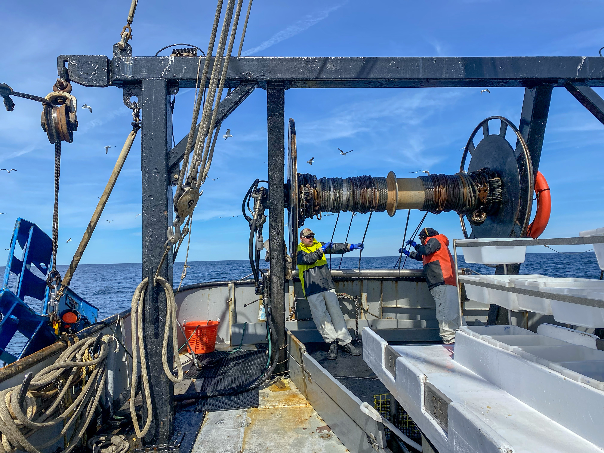

# 2022 NTAP Restrictor Rope Reserch Repository

Analysis of data collected by NTAP field work on the F/V Darana R in Spring 2022 and Fall 2022. For this experiment paired tows were made to assess the impact of a restrictor rope on catches and net geometry. Work in this format is aimed at better understanding the potential application of this type of gear to better standardize trawl gear performance.

---

## Repository contents

1. Script to import data from MS Access database and perform analysis [knit .Rmd](https://github.com/AJONES8/PEMAD_CRB_NTAP_RESTRICTOR_ROPE_EXP/blob/main/FMRD_CRB_NTAP_Restrictor_Rev_Oct_v1.md)
2. Figures associated with the draft manuscript of experimental results.

---
This repository is a scientific product and is not official communication of the National Oceanic and Atmospheric Administration, or the United States Department of Commerce. All NOAA GitHub project code is provided on an ‘as is’ basis and the user assumes responsibility for its use. Any claims against the Department of Commerce or Department of Commerce bureaus stemming from the use of this GitHub project will be governed by all applicable Federal law. Any reference to specific commercial products, processes, or services by service mark, trademark, manufacturer, or otherwise, does not constitute or imply their endorsement, recommendation or favoring by the Department of Commerce. The Department of Commerce seal and logo, or the seal and logo of a DOC bureau, shall not be used in any manner to imply endorsement of any commercial product or activity by DOC or the United States Government.
